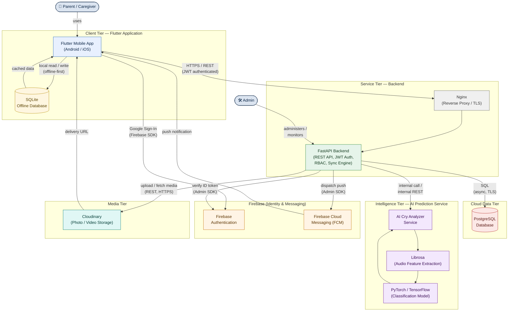
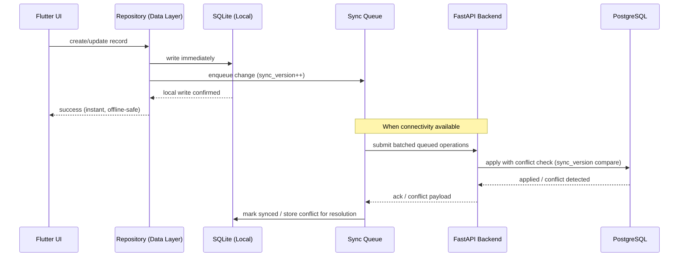
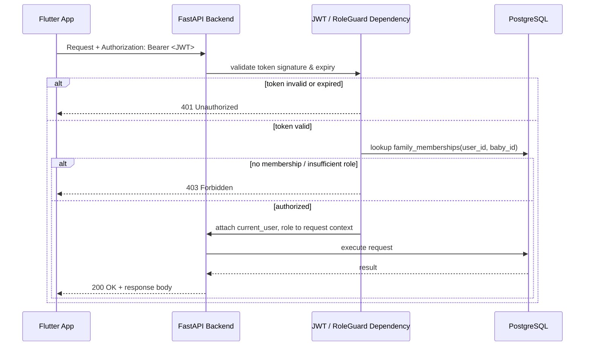
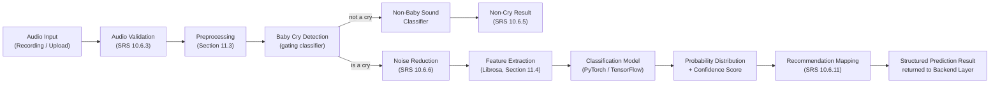
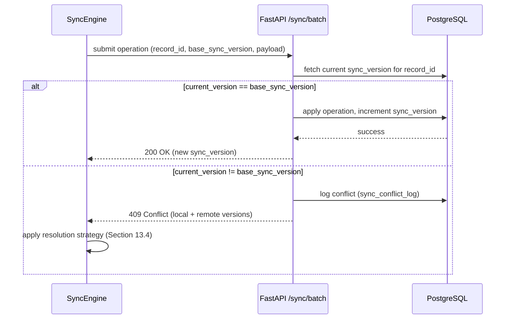
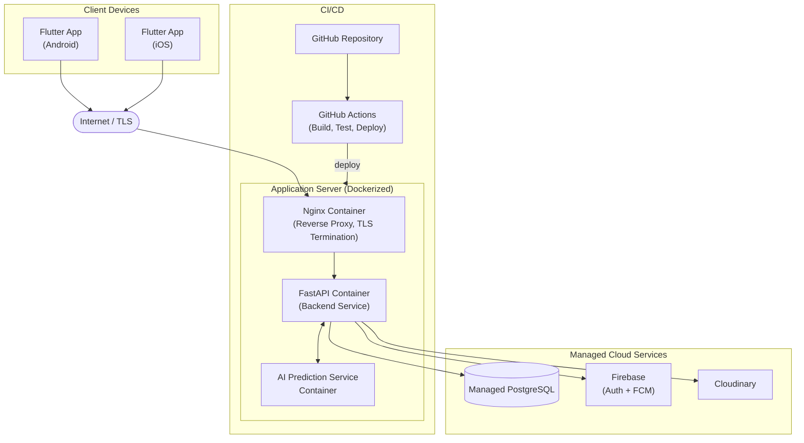

SOFTWARE ARCHITECTURE DOCUMENT

Document Title: Software Architecture Document (SAD) for LullaByte – AI Powered Newborn Care Assistant
Companion Document To: Software Requirements Specification (SRS) — `docs/LullaByte_SRS.md`
Document Version: 1.0 (Draft)
Author: Angel Joseph
Institution: Vimal Jyothi Engineering College — B.Tech Computer Science and Engineering
Status: Part 1 of multi-part document (Sections 1–7)

---

# 1. Introduction

## 1.1 Purpose

This Software Architecture Document (SAD) defines the technical architecture of LullaByte — an AI-powered newborn care assistant — translating the functional and non-functional requirements captured in the Software Requirements Specification (SRS, `docs/LullaByte_SRS.md`) into a coherent, implementable system design.

Where the SRS defines **what** the system must do, this document defines **how** the system is structured to do it: its major components, the technology used to build each of them, the architectural patterns governing how code is organized, and the layered structure that separates concerns across the mobile client, backend services, AI subsystem, and cloud infrastructure.

This document is intended to be read alongside the SRS. It does not restate functional requirements in detail; instead, it references the relevant SRS section (e.g., "per SRS Section 10.6") wherever a requirement drives an architectural decision. The SRS remains the authoritative source for functional scope and is not modified by this document.

## 1.2 Scope

This SAD covers the architecture of the complete LullaByte system as scoped in SRS Section 3 (System Scope), comprising:

- The **Flutter mobile client application**, implementing all functional modules defined in SRS Section 10 (Authentication through Settings).
- The **FastAPI backend service layer**, exposing the API surface consumed by the client and orchestrating business logic, data persistence, and AI inference.
- The **PostgreSQL cloud database**, serving as the authoritative structured data store.
- The **SQLite local database**, enabling the offline-first operation required by SRS Section 10.18.
- The **AI Prediction Service**, implementing the Cry Analyzer (SRS Section 10.6) and AI Parenting Assistant (SRS Section 10.15).
- **Firebase** (Authentication and Cloud Messaging), supporting identity and notification delivery (SRS Sections 10.1, 10.17).
- **Cloudinary**, providing cloud media storage and delivery for the Gallery module (SRS Section 10.12).

This document covers architecture only. It does not include source code, detailed class-level design, or database schema DDL — those are downstream deliverables informed by this SAD, consistent with the Related Internal Documents identified in SRS Section 5.3.

This Part 1 of the SAD covers Sections 1 through 7 (Introduction, Architectural Goals, Overall System Architecture, High-Level Architecture Diagram, Technology Stack, Architectural Patterns, and Software Layers). Subsequent parts, to be produced upon confirmation, are expected to cover component-level design, data architecture, API design, AI pipeline architecture, deployment architecture, and cross-cutting concerns in greater depth.

## 1.3 Intended Audience

| Audience | Purpose of Use |
|---|---|
| Flutter/Mobile Developers | To understand client-side architecture, state management, and offline-sync responsibilities before implementation |
| Backend Developers (FastAPI/Python) | To understand service boundaries, API responsibilities, and integration points with PostgreSQL, Firebase, Cloudinary, and the AI subsystem |
| AI/ML Engineers | To understand where the AI Prediction Service sits in the overall system and how it is invoked, versioned, and scaled |
| Database Architects | To understand the relationship between the cloud (PostgreSQL) and local (SQLite) data stores and the synchronization boundary between them |
| DevOps/Infrastructure Engineers | To understand deployment topology, containerization, and reverse-proxy requirements |
| QA/Test Engineers | To understand system boundaries and integration points for test planning |
| Academic Evaluators | To assess the technical soundness, coherence, and completeness of the proposed architecture for a final-year engineering project |
| Future Maintainers | To understand the architectural rationale behind component boundaries and pattern choices before extending the system |

## 1.4 Definitions

This document uses the terms, acronyms, and abbreviations already defined in SRS Section 4, which apply here without restatement. The following additional architecture-specific terms are used throughout this document:

| Term | Definition |
|---|---|
| **Client** | The Flutter mobile application installed on a user's device. |
| **Backend / Service Layer** | The FastAPI application exposing the REST API consumed by the Client. |
| **AI Prediction Service** | The subsystem responsible for cry classification (SRS Section 10.6) and AI Assistant response generation (SRS Section 10.15), whether co-located with or separated from the core backend. |
| **Source of Truth** | The dataset considered authoritative when local and cloud data diverge; for LullaByte, PostgreSQL is the cloud source of truth, reconciled with the on-device SQLite store per the Synchronization Strategy (Section 13.4 of the SRS). |
| **Repository (architectural sense)** | An abstraction layer that mediates between domain/business logic and the underlying data source (local database, remote API, or cache), consistent with the Repository Pattern (Section 6.2 of this document). |
| **Feature Module** | A self-contained, vertically sliced unit of the Flutter application corresponding to one functional module of SRS Section 10 (e.g., the Feeding Tracker feature module). |
| **Bounded Context** | A logical boundary within the backend service layer within which a specific model of the domain (e.g., Vaccination Management) applies consistently. |

## 1.5 References

| Reference | Description |
|---|---|
| `docs/LullaByte_SRS.md` | Software Requirements Specification for LullaByte (v1.1, Final) — the authoritative functional and non-functional requirements source for this architecture. |
| SRS Section 11 | Non-Functional Requirements — directly informs the Architectural Goals in Section 2 of this document. |
| SRS Section 12 | External Interface Requirements — informs the component boundaries in Section 3 and Section 4 of this document. |
| SRS Section 13 | Database Requirements — informs the data architecture referenced in Sections 3, 4, and 7 of this document. |
| SRS Section 14 | Security Requirements — informs security-relevant architectural decisions referenced throughout this document. |
| IEEE Std 830-1998 | Referenced by the SRS; architectural traceability in this document is expressed relative to SRS section numbers. |
| ISO/IEC/IEEE 42010:2011 | Systems and software engineering — Architecture description — informal structural reference for organizing this SAD (stakeholders, viewpoints, views). |
| Flutter Official Documentation | https://docs.flutter.dev — reference for Flutter/Dart architectural conventions used in Sections 5–7. |
| FastAPI Official Documentation | https://fastapi.tiangolo.com — reference for backend architectural conventions used in Sections 5–7. |

---

# 2. Architectural Goals

## 2.1 Purpose of This Section

This section defines the architectural quality attributes that LullaByte's design must satisfy. Each goal is directly traceable to the Non-Functional Requirements defined in SRS Section 11, and each subsequent architectural decision in this document (component boundaries, pattern selection, layering) is justified against one or more of these goals.

## 2.2 Scalability

**Goal:** The architecture must scale from a single-user prototype to a multi-tenant, publicly distributed application (SRS Section 6.4, Section 11.5) without requiring fundamental redesign.

**Architectural implication:** The backend is designed as a stateless FastAPI service, horizontally scalable behind a load balancer/reverse proxy (Section 5, Nginx). The AI Prediction Service is architected as an independently scalable component (Section 3.4), decoupled from the core API service, since inference workloads (SRS NFR-PERF-06–08) have a materially different resource profile (CPU/GPU-bound) than typical CRUD API traffic. PostgreSQL is used as the cloud store specifically for its proven horizontal read-scaling (replicas) and vertical scaling characteristics at the data tier.

## 2.3 Reliability

**Goal:** The system must behave predictably under partial failure, network loss, and concurrent multi-device usage (SRS Section 11.2), without silent data loss.

**Architectural implication:** All write paths from the Flutter client pass first through the local SQLite store (Section 3.6), which acts as a durable buffer; the Synchronization Engine (SRS Section 10.18) is the sole path by which local writes reach PostgreSQL, with retry and conflict-resolution logic architecturally isolated from the UI and domain layers (Section 7.4–7.5).

## 2.4 Offline-First

**Goal:** Core tracking functionality must be fully usable without connectivity (SRS Section 3.2, Section 10.18), a goal specific to LullaByte's real-world usage context (a parent logging a 3 a.m. feeding with no reliable Wi-Fi).

**Architectural implication:** SQLite is treated as a first-class local data source, not merely a cache. The Flutter application's Repository layer (Section 6.2, Section 7.4) always reads from and writes to SQLite first; PostgreSQL is reached only indirectly, through background synchronization. This inversion — local-first rather than remote-first — is the single most significant architectural decision in this system and shapes the Data Layer design described in Section 7.4.

## 2.5 Security

**Goal:** The architecture must protect sensitive medical and personal data belonging to infants and their families (SRS Section 14) at every layer — client storage, transport, and cloud storage.

**Architectural implication:** JWT-based authentication (Section 5) is enforced at the API gateway boundary of the backend; the local SQLite database is encrypted at rest (SRS SEC-SQLENC-01); all client-backend and backend-third-party traffic is TLS-encrypted (SRS Section 14.4, 14.6). Role-Based Access Control (SRS Section 10.20.4) is enforced at the backend's data-access layer, not solely in the Flutter client, consistent with the defense-in-depth principle established in SRS SEC-RBAC-01.

## 2.6 Performance

**Goal:** The system must meet the response-time, startup-time, and AI-inference-time targets defined in SRS Section 11.1.

**Architectural implication:** Local-first reads (Section 2.4) inherently satisfy most UI response-time targets, since the vast majority of user interactions never wait on a network round trip. The AI Prediction Service is architected to run inference asynchronously with clear progress signaling back to the client (SRS NFR-PERF-07), and the backend applies request prioritization so structured-data synchronization is not blocked behind larger media uploads (SRS NFR-PERF-12).

## 2.7 Accessibility

**Goal:** The architecture must not constrain or compromise the accessibility-first design mandated by SRS Section 15, particularly for deaf and hard-of-hearing users.

**Architectural implication:** Accessibility is treated as a client-architecture concern rather than a purely visual/design concern: notification delivery is architected to always carry a structured payload capable of driving both a visual banner and a haptic trigger (Section 3, Firebase Cloud Messaging integration), never an audio-only signal, so that no future feature can be implemented in a way that silently depends on sound.

## 2.8 AI Integration

**Goal:** AI capability (Cry Analyzer, AI Parenting Assistant) must be integrated as a well-bounded, replaceable service, not entangled with core application logic, so that models can be retrained, upgraded, or swapped (SRS Section 16.4) without destabilizing the rest of the system.

**Architectural implication:** The AI Prediction Service is architected as a distinct component (Section 3.4, Section 4) behind a stable internal API contract, consuming audio/text input and returning structured predictions. The backend treats this service as an external dependency, applying the same timeout, retry, and graceful-degradation handling it would apply to any third-party integration.

## 2.9 Maintainability

**Goal:** The codebase must remain comprehensible and safely extensible across the lifetime of a project with 21 functional modules and 183 functional sub-modules (SRS Section 10), consistent with SRS Section 11.4.

**Architectural implication:** Clean Architecture and a Feature-first module structure (Section 6) are adopted specifically to bound the blast radius of any single change — a defect or enhancement in the Diaper Tracker feature should never require touching the Vaccination Management feature's code.

## 2.10 Modular Design

**Goal:** Every major functional module identified in SRS Section 8 must correspond to a clearly bounded unit of the codebase on both the client and backend, enabling independent development, testing, and (eventually) team ownership.

**Architectural implication:** The Feature-first Architecture (Section 6.4) on the client and the bounded-context organization of the backend's API routers and service modules (Section 3.2) are deliberately mirrored, so a developer working on, for example, Milestone Tracking touches a predictable, self-contained set of files on both sides of the stack.

---

# 3. Overall System Architecture

## 3.1 Architectural Overview

LullaByte is architected as a **layered, offline-first, client-heavy mobile system** backed by a stateless service layer and a set of specialized external services. The system is deliberately not a "thin client / thick backend" design; because offline capability (SRS Section 10.18) is a first-class requirement, the Flutter client owns a complete, independently functional data layer (SQLite) and only synchronizes with the cloud opportunistically.

At the highest level, the system is composed of the following logical tiers, presented here in the request/data flow order most relevant to a typical user action (e.g., logging a feeding, or submitting a cry recording for analysis):

```
Flutter Application (Client Tier)
        ↓
FastAPI Backend (Service Tier)
        ↓
PostgreSQL Database (Cloud Data Tier)
        ↓
AI Prediction Service (Intelligence Tier)
        ↓
Firebase (Identity & Messaging Tier)
        ↓
Cloudinary (Media Tier)
        ↓
SQLite Offline Database (Local Data Tier)
```

This linear presentation is a simplification for readability; the actual communication is not a strict single-direction pipeline. Section 3.3 describes the true, non-linear communication topology, and Section 4 presents it as a diagram. The remainder of this section describes the role of each tier and how it communicates with its neighbors.

## 3.2 Role of Each Component

### 3.2.1 Flutter Application (Client Tier)

The Flutter application is the sole user-facing surface of LullaByte, implementing every functional module defined in SRS Section 10, for both Android and iOS from a single codebase (SRS NFR-PORT-01–03). Its responsibilities include:

- Rendering all UI defined implicitly by the functional requirements (Dashboard, Cry Analyzer, trackers, Settings, etc.).
- Owning the local SQLite database and treating it as the primary data source for all reads and writes (Section 2.4).
- Capturing device-level input: microphone audio (Cry Analyzer), camera/gallery media (Gallery, Milestones), and biometric/authentication input.
- Presenting all accessibility-first behavior mandated by SRS Section 15 — visual notification rendering, haptic feedback triggering, dynamic font scaling, and high-contrast theming.
- Initiating synchronization with the backend when connectivity is available, and gracefully queuing changes when it is not.

### 3.2.2 FastAPI Backend (Service Tier)

The backend is a stateless HTTP API service that mediates all interaction between the client and the system's shared, authoritative resources. Its responsibilities include:

- Authenticating and authorizing every request (SRS Section 14.1, 14.3), issuing and validating JWTs.
- Enforcing all server-side Validation Rules and business logic defined per module in SRS Section 10, as the authoritative check behind client-side validation (SRS SEC-INPUT-01).
- Enforcing Role-Based Access Control (SRS Section 10.20.4) on every data-access request, independent of client-side UI restrictions.
- Orchestrating calls to PostgreSQL, Firebase, Cloudinary, and the AI Prediction Service on behalf of the client, so the client never talks to those services directly with the exception of narrowly scoped, token-authorized cases (e.g., direct-to-Cloudinary signed uploads, where used, to reduce backend bandwidth load).
- Processing the Synchronization Queue submitted by clients (SRS Section 10.18.3–10.18.7), including Conflict Detection and Conflict Resolution.

### 3.2.3 PostgreSQL Database (Cloud Data Tier)

PostgreSQL is the authoritative, structured, multi-tenant data store for the entire system, per SRS Section 13.1. Its responsibilities include:

- Persisting every structured entity defined in the Entity Relationship summary (SRS Section 13.5): User Accounts, Baby Profiles, Feeding/Sleep/Diaper records, Vaccination Schedules, Milestones, Growth Records, Cry Prediction History, Family Sharing memberships, and audit logs.
- Enforcing referential integrity between Baby Profiles and all dependent records (SRS DB-PG-03), which underpins the Data Separation requirement (SRS Section 10.4.4).
- Serving as the "source of truth" against which the SQLite Offline Database is reconciled during synchronization.

### 3.2.4 AI Prediction Service (Intelligence Tier)

The AI Prediction Service is a specialized inference component, invoked by the FastAPI backend rather than directly by the client, implementing:

- The full Cry Analyzer pipeline (SRS Section 10.6.3–10.6.11): audio validation, baby-cry detection, non-baby-sound detection, noise reduction, feature extraction (via Librosa), classification (via a PyTorch or TensorFlow model), and recommendation generation.
- The AI Parenting Assistant's response-generation logic (SRS Section 10.15), including the AI Safety Disclaimer enforcement (SRS Section 10.15.9) as a mandatory post-processing step on every generated response.

This tier is described as logically distinct from the FastAPI backend regardless of whether it is deployed as a separate microservice or as an in-process module during early-stage development (see Section 2.8 and Section 3.4).

### 3.2.5 Firebase (Identity & Messaging Tier)

Firebase is used as a supporting managed-service layer for two distinct capabilities (SRS Section 12.6):

- **Firebase Authentication**, supporting Google Sign-In (SRS Section 10.1.3) and, optionally, underlying phone-number verification flows for Phone OTP (SRS Section 10.1.4), beneath the application's own account/session model (SRS Section 10.1.6).
- **Firebase Cloud Messaging (FCM)**, delivering Push Notifications (SRS Section 10.17.7) to client devices for reminders, alerts, and family-sharing events.

### 3.2.6 Cloudinary (Media Tier)

Cloudinary provides managed cloud storage, transformation, and delivery for all photo and video media captured through the Gallery and Milestone modules (SRS Section 10.12.7, Section 12.7), including automatic thumbnail generation used by Grid View (SRS Section 10.12.4).

### 3.2.7 SQLite Offline Database (Local Data Tier)

SQLite is the on-device, embedded relational database described in SRS Section 13.2, structurally mirroring the PostgreSQL schema (SRS DB-PG-02). It is not a cache in the traditional sense — it is the primary read/write target for the Flutter application under normal operation (Section 2.4), encrypted at rest (SRS SEC-SQLENC-01) and reconciled with PostgreSQL via the Synchronization Engine.

## 3.3 Component Communication

| From | To | Protocol / Mechanism | Purpose |
|---|---|---|---|
| Flutter Application | SQLite (local) | In-process SQL (via a local database driver) | Primary read/write path for all offline-capable modules (SRS Section 10.18.1) |
| Flutter Application | FastAPI Backend | HTTPS / REST (JSON), authenticated via JWT | All server-mediated operations: authentication, synchronization, AI inference requests, family-sharing invitations |
| Flutter Application | Firebase Cloud Messaging | Platform push channel (FCM SDK) | Receiving Push Notifications (SRS Section 10.17.7) |
| Flutter Application | Firebase Authentication | Firebase SDK over HTTPS | Google Sign-In identity token acquisition (SRS Section 10.1.3) |
| FastAPI Backend | PostgreSQL | SQL over an encrypted connection (via an async ORM/driver) | All structured data persistence and querying |
| FastAPI Backend | AI Prediction Service | Internal HTTPS/REST call or in-process function call (deployment-dependent, Section 3.4) | Cry Analyzer inference (SRS Section 10.6.8) and AI Assistant response generation (SRS Section 10.15.1) |
| FastAPI Backend | Firebase Authentication | Firebase Admin SDK over HTTPS | Verifying client-presented identity tokens |
| FastAPI Backend | Firebase Cloud Messaging | Firebase Admin SDK over HTTPS | Dispatching Push Notifications on behalf of the Notification System (SRS Section 10.17) |
| FastAPI Backend | Cloudinary | Cloudinary REST API over HTTPS | Uploading, transforming, and generating delivery URLs for Gallery/Milestone media |
| AI Prediction Service | FastAPI Backend | Structured JSON response (prediction result / assistant response) | Returning classification probabilities, confidence scores, and recommendations, or assistant response text |
| Flutter Application (Offline Queue) | FastAPI Backend | Batched HTTPS / REST submission of the Synchronization Queue | Offline Synchronization (SRS Section 10.18.3–10.18.11) |

## 3.4 Deployment Flexibility of the AI Prediction Service

Given this is a final-year engineering project with a realistic development timeline, the AI Prediction Service is architected so it MAY be deployed in either of two configurations without changing the FastAPI backend's internal API contract toward it:

1. **In-process module**, loaded directly within the FastAPI application during early development and demonstration phases, minimizing infrastructure overhead.
2. **Independently deployed service**, reachable over an internal network call, once inference load or model-serving requirements (e.g., GPU scheduling) justify separation — directly supporting the Scalability goal (Section 2.2) and NFR-SCALE-04 in the SRS.

This flexibility is achieved by defining a stable internal service interface (a Python-level abstract interface in the in-process case, or a REST contract in the separated case) that the rest of the backend depends on, never on the AI subsystem's internal implementation details.

## 3.5 Data Flow Example: Cry Analyzer Submission

To make the architecture concrete, the following describes the full component interaction for a single representative use case — a parent recording and submitting a cry for analysis (SRS Section 10.6):

1. The Flutter Application captures audio via the device microphone (Live Recording, SRS Section 10.6.1) and performs local Audio Validation checks.
2. The Flutter Application submits the audio to the FastAPI Backend over HTTPS, authenticated with the user's JWT.
3. The FastAPI Backend validates the request, persists a pending prediction record, and invokes the AI Prediction Service.
4. The AI Prediction Service runs Baby Cry Detection, Noise Reduction, Feature Extraction (Librosa), and classification (PyTorch/TensorFlow model), returning a structured result.
5. The FastAPI Backend persists the completed prediction to PostgreSQL and returns the result to the Flutter Application.
6. The Flutter Application writes the result into the local SQLite database (so it is available offline thereafter) and renders the Confidence Score, Probability Distribution, and Recommendations (SRS Section 10.6.9–10.6.11).
7. If the device later goes offline and the user reopens Prediction History, the data is served entirely from SQLite, with no dependency on steps 2–5.

## 3.6 Data Flow Example: Offline Feeding Log Entry

1. A parent logs a Bottle Feeding entry (SRS Section 10.7.2) while offline. The Flutter Application writes the record directly and exclusively to SQLite; no backend call is attempted.
2. The write is simultaneously appended to the local Synchronization Queue (SRS Section 10.18.3).
3. When connectivity is restored, the Flutter Application's synchronization component transmits the queued operation to the FastAPI Backend.
4. The FastAPI Backend applies Conflict Detection against PostgreSQL (SRS Section 10.18.6) and, finding no conflict, persists the record.
5. The FastAPI Backend acknowledges the operation; the Flutter Application marks the local record as synchronized and removes it from the queue.

This pair of examples illustrates the core architectural principle stated in Section 2.4: the client is fully functional independent of steps 2 onward in the Cry Analyzer example, and independent of steps 3 onward in the Feeding Log example — connectivity extends the system's capability but never gates its core usability.

---

# 4. High-Level Architecture Diagram

## 4.1 Diagram

The following diagram presents the complete system architecture: the human actors (Parent/Caregiver and Admin), the Flutter client and its local data store, the FastAPI backend and its cloud data store, the AI Prediction Service and its constituent libraries, and the external managed services (Firebase, Cloudinary).



## 4.2 Diagram Notes

- **Parent/Caregiver** is the primary actor, interacting exclusively with the Flutter Application, consistent with the User Characteristics defined in SRS Section 9.
- **Admin** is shown interacting with the backend directly, representing operational/administrative access (monitoring, moderation, and configuration) rather than a defined end-user role in SRS Section 10; this reflects the operational reality of running the platform rather than a functional requirement, and is included here to complete the architectural picture requested for this diagram.
- The **SQLite** node is drawn inside the Client Tier boundary, not the cloud, to visually reinforce the offline-first principle established in Section 2.4 — it is part of the client, not a remote dependency.
- **Nginx** sits in front of FastAPI as a reverse proxy, terminating TLS and providing the single ingress point referenced in Section 5 and the deployment architecture to be detailed in a later part of this document.
- The **AI Prediction Service** subgraph shows Librosa and the PyTorch/TensorFlow model as internal constituents of the Cry Analyzer, not independently reachable services, consistent with Section 3.4.
- Arrows represent the dominant direction of request initiation; several interactions (e.g., FCM to Flutter Application) are inherently asynchronous push flows rather than request/response pairs.

---

# 5. Technology Stack

## 5.1 Purpose

This section specifies the concrete technology selections underlying the architecture described in Sections 3 and 4, with justification for each selection tied back to the Architectural Goals in Section 2 and the System Constraints identified in SRS Section 6.6.

## 5.2 Technology Stack Table

| Technology | Purpose | Reason for Selection | Version (Recommended) |
|---|---|---|---|
| **Flutter** | Cross-platform mobile UI framework for the Client Tier | Single codebase for Android and iOS (SRS NFR-PORT-01–03), high-performance native compilation, and mature ecosystem support for offline-first apps, directly supporting the Portability goal (Section 2, SRS Section 11.6) | 3.24.x (stable channel) |
| **Dart** | Programming language for the Flutter application | Native language of the Flutter SDK; sound null safety and strong typing reduce runtime defects, supporting the Reliability and Maintainability goals (Section 2.3, 2.9) | 3.5.x |
| **FastAPI** | Backend web framework for the Service Tier | High-performance asynchronous Python framework with native OpenAPI schema generation (supporting NFR-MAINT-06), first-class async support suited to I/O-bound orchestration across PostgreSQL, Firebase, Cloudinary, and the AI service | 0.115.x |
| **Python** | Backend implementation language | Rich ecosystem for both API development (FastAPI) and AI/ML integration (PyTorch, TensorFlow, Librosa), avoiding a language boundary between the backend and AI Prediction Service | 3.12.x |
| **PostgreSQL** | Cloud structured data store | Strong relational integrity guarantees (foreign keys, transactions) required by Data Separation (SRS Section 10.4.4) and Database Requirements (SRS Section 13.1), proven horizontal/vertical scalability, and mature managed-hosting availability | 16.x |
| **SQLite** | Local/offline structured data store | Embedded, zero-configuration relational database with strong Flutter ecosystem support (via `sqflite`/`drift`), directly enabling the Offline-First goal (Section 2.4, SRS Section 13.2) | 3.45.x (bundled engine) |
| **Firebase Authentication** | Identity provider supporting Google Sign-In and OTP-adjacent flows | Managed, security-hardened identity infrastructure reduces the custom security surface area the team must build and maintain (SRS Section 10.1.3, Section 12.6) | Firebase SDK (BoM) 33.x |
| **Firebase Cloud Messaging (FCM)** | Cross-platform push notification delivery | Industry-standard, free-tier-friendly push infrastructure supporting both Android and iOS from a single integration, directly enabling Push Notifications (SRS Section 10.17.7) | Firebase SDK (BoM) 33.x |
| **Cloudinary** | Cloud media storage, transformation, and delivery | Purpose-built for image/video storage with automatic thumbnailing and format optimization, reducing backend engineering effort for Gallery Cloud Backup (SRS Section 10.12.7) | REST API v1_1 |
| **Riverpod** | State management and dependency injection for Flutter | Compile-safe, testable state management with native support for the Dependency Injection pattern (Section 6.5) and clean separation between UI and business logic, supporting Maintainability (Section 2.9) | 2.6.x |
| **Dio** | HTTP client for Flutter | Interceptor-based architecture cleanly supports centralized JWT attachment, retry logic, and error normalization required by the Synchronization Engine (SRS Section 10.18.8) | 5.7.x |
| **JWT (JSON Web Token)** | Authentication token format | Stateless, signed tokens allow the FastAPI backend to remain horizontally scalable (Section 2.2) without shared session storage, consistent with SRS Section 14.1 | RFC 7519 (via `python-jose` / `pyjwt`) |
| **TensorFlow** | Machine learning framework (candidate) for the Cry Analyzer classification model | Mature deployment tooling (TensorFlow Lite/Serving) suited to eventual on-device or scaled server-side inference | 2.17.x |
| **PyTorch** | Machine learning framework (candidate) for the Cry Analyzer classification model | Strong research-to-production tooling and wide academic adoption, well suited to a final-year project's iterative model development | 2.4.x |
| **Librosa** | Audio feature extraction library | Purpose-built Python library for audio analysis (spectrograms, MFCCs), directly supporting Feature Extraction (SRS Section 10.6.7) | 0.10.x |
| **Docker** | Containerization of the backend and AI service | Ensures consistent, reproducible deployment across development and production environments, and simplifies independent scaling of the AI Prediction Service (Section 3.4) | 27.x (Engine) |
| **Nginx** | Reverse proxy / TLS termination | Battle-tested, high-performance reverse proxy providing the single HTTPS ingress point required by SRS Section 14.4, and supporting future load-balancing across multiple backend instances (Section 2.2) | 1.27.x |
| **Git** | Version control | Industry-standard distributed version control, required for any team-based or individually tracked software engineering project | 2.46.x |
| **GitHub** | Source hosting, issue tracking, CI/CD | Centralized repository hosting with integrated Actions for CI/CD, supporting Maintainability (Section 2.9, SRS NFR-MAINT-04) | N/A (SaaS) |
| **VS Code** | Primary IDE for backend/AI development | Lightweight, extensible editor with strong Python and Docker tooling support | Latest stable |
| **Android Studio** | Primary IDE for Flutter/mobile development | Official, fully-featured IDE for Flutter and native Android tooling, including emulator management | Latest stable (Ladybug+) |

## 5.3 Selection Principles

Across all entries in Section 5.2, three consistent principles governed selection:

1. **Alignment with the Architectural Goals (Section 2)** — every technology was chosen with a specific, named goal in mind (e.g., Riverpod for Maintainability, PostgreSQL for Reliability), rather than by default familiarity alone.
2. **Consistency with SRS System Constraints** — the stack matches the technology constraints already identified in the SRS (Flutter, FastAPI, SQLite, PostgreSQL, PyTorch, TensorFlow, Firebase, Cloudinary), ensuring this architecture is a direct realization of, not a deviation from, the requirements baseline.
3. **Feasibility for a final-year academic project timeline** — every selected technology has mature documentation, active community support, and a free or low-cost tier suitable for student development and demonstration, avoiding infrastructure that would be disproportionately costly or complex to operate for this project's scope.

---

# 6. Architectural Patterns

## 6.1 Clean Architecture

**Why used:** Clean Architecture is applied across both the Flutter client and the FastAPI backend to enforce a strict dependency direction — outer layers (UI, database drivers, external APIs) depend inward on business logic, never the reverse. This directly serves the Maintainability and Modular Design goals (Section 2.9–2.10) given the system's scale (21 functional modules, SRS Section 10).

**Advantages:**
- Business rules (e.g., Validation Rules per SRS module) remain independent of any specific UI framework or database engine, so the Domain Layer (Section 7.3) can be unit-tested without a running Flutter widget tree or a live database connection.
- The local-first vs. cloud-first data source (Section 2.4) can be swapped or dual-implemented behind a stable interface without touching business logic, which is essential to the Offline-First goal.
- New engineers (or graders evaluating this project) can reason about one layer at a time rather than the system as an undifferentiated whole.

## 6.2 Repository Pattern

**Why used:** Every data-producing module in SRS Section 10 (Feeding, Sleep, Diaper, Cry History, etc.) requires reads and writes that may be satisfied by SQLite, by a pending remote call, or eventually by PostgreSQL. The Repository Pattern gives each feature a single, consistent interface (e.g., `FeedingRepository`) that internally decides whether to serve from the local database or trigger synchronization, hiding that decision entirely from the UI and domain logic.

**Advantages:**
- Directly operationalizes the Offline-First goal (Section 2.4): the rest of the application never needs to know whether it is "online" or "offline" — it simply calls the repository.
- Centralizes the enforcement of Data Separation (SRS Section 10.4.4) and Role-Based Access filtering (SRS Section 10.20.4) in one place per entity type, rather than scattering baby-profile-scoping logic across every screen or endpoint.
- Simplifies testing, since repositories can be mocked at a single, well-defined seam.

## 6.3 MVVM (Model-View-ViewModel)

**Why used:** On the Flutter client, MVVM (realized via Riverpod's `Notifier`/`AsyncNotifier` classes acting as ViewModels) cleanly separates what a screen displays (View) from the state and logic driving it (ViewModel), with the Model layer supplied by the Repository/Domain layers beneath it (Section 6.1–6.2).

**Advantages:**
- UI widgets remain "dumb" — they render state and forward user actions, with no business logic embedded in widget code, which keeps screens for 21 different modules structurally consistent and easy to navigate.
- ViewModels are independently testable without instantiating any actual UI, supporting the Reliability goal (Section 2.3) through more thorough automated test coverage.
- Reactive state updates (e.g., a Dashboard Daily Summary recalculating immediately after a new Feeding entry, per SRS Section 10.5.2) fall out naturally from the ViewModel's state-notification mechanism.

## 6.4 Feature-First Architecture

**Why used:** Rather than organizing the Flutter codebase by technical type (all screens together, all repositories together, etc.), LullaByte organizes code by feature — one self-contained module per SRS Section 10 functional module (`feeding/`, `sleep/`, `vaccination/`, `cry_analyzer/`, etc.), each internally structured per Clean Architecture (Section 6.1).

**Advantages:**
- Directly satisfies the Modular Design goal (Section 2.10): a developer assigned to Milestone Tracking works almost entirely within one directory, rarely needing to touch unrelated code.
- Reduces merge conflicts and cognitive load in a project with a very large functional surface area, since features rarely share implementation files.
- Makes the eventual removal, redesign, or independent versioning of a single module (e.g., replacing the Gallery implementation) low-risk, since its boundaries are already explicit.

## 6.5 Dependency Injection

**Why used:** Both tiers rely on Dependency Injection — Riverpod providers on the Flutter client, and FastAPI's built-in `Depends()` system on the backend — to supply concrete implementations (a specific repository, a specific database session, the current authenticated user) into the layers that need them, rather than having those layers construct their own dependencies.

**Advantages:**
- Enables the AI Prediction Service's deployment flexibility described in Section 3.4: the backend can be wired to an in-process implementation or a remote-call implementation of the same interface purely through injection configuration.
- Makes unit testing tractable across the entire system, since any dependency (database, external API client) can be substituted with a test double at the injection point.
- Enforces the inward-pointing dependency rule central to Clean Architecture (Section 6.1) by making dependency direction explicit and centrally configured rather than implicit.

## 6.6 Offline-First Strategy

**Why used:** As established in Section 2.4, offline capability is not an add-on but a foundational strategy shaping the entire Data Layer. Concretely, this means: SQLite is written to synchronously and immediately for every user action; the Synchronization Queue (SRS Section 10.18.3) is the only mechanism by which changes reach PostgreSQL; and every UI read is served from SQLite, never blocked on a network call.

**Advantages:**
- Guarantees the application remains fully usable in the low-connectivity, high-urgency contexts identified in SRS Section 9.2 (a parent using the app one-handed at night), directly serving the project's core accessibility and stress-reduction objectives (SRS Section 2.3).
- Decouples perceived application performance from network conditions entirely, which is the primary mechanism by which the Performance goal (Section 2.6) and its associated NFR-PERF targets (SRS Section 11.1) are met.
- Provides natural resilience: a backend outage degrades only synchronization and AI-dependent features (Cry Analyzer inference, AI Assistant), never core daily-use tracking, consistent with the Reliability goal (Section 2.3, SRS NFR-REL-10).

---

# 7. Software Layers

## 7.1 Purpose of This Section

This section describes the complete layered structure of LullaByte, spanning both the client and server codebases as well as the surrounding data and cloud infrastructure. Each layer is described in terms of its Purpose, Responsibilities, Communication (what it talks to, and how), and Advantages, consistent with the Clean Architecture and layering principles established in Section 6.

## 7.2 Presentation Layer (Flutter Client — UI)

**Purpose:** To render the user interface for every functional module defined in SRS Section 10 and translate user interaction into ViewModel actions, in a manner consistent with the accessibility-first principles of SRS Section 15.

**Responsibilities:**
- Rendering screens, widgets, navigation (SRS Section 10.5.6), and theming (Light/Dark/High-Contrast, SRS Section 10.21.2, Section 15.10).
- Displaying state exposed by the Application Layer's ViewModels (loading, success, error, empty states) as specified throughout the Error Handling and Success Conditions subsections of SRS Section 10.
- Capturing raw user input (form entries, gestures, microphone/camera triggers) and forwarding it to the Application Layer without embedding business logic.

**Communication:** Communicates exclusively downward to the Application Layer (Section 7.3), via Riverpod-exposed state and callbacks (Section 6.3). Never communicates directly with the Domain, Data, or Backend layers.

**Advantages:** Keeps UI code declarative and framework-idiomatic; enables consistent application of accessibility requirements (Section 2.7) at a single architectural chokepoint; allows UI redesigns (e.g., a future Material 3 refresh) without risk to underlying logic.

## 7.3 Application Layer (Flutter Client — ViewModels / State Management)

**Purpose:** To hold and manage UI-facing state and orchestrate calls into the Domain Layer in response to user actions, implementing the ViewModel half of the MVVM pattern (Section 6.3).

**Responsibilities:**
- Translating a user action (e.g., "Save Feeding entry") into one or more Domain Layer use-case invocations.
- Managing loading/error/success state for each screen or feature, and exposing it reactively to the Presentation Layer.
- Coordinating cross-feature UI state where necessary (e.g., the Dashboard's Daily Summary, SRS Section 10.5.2, aggregating state touched by multiple feature modules).

**Communication:** Receives calls from the Presentation Layer (Section 7.2); calls downward into the Domain Layer (Section 7.4). Does not access the Data Layer or any repository directly.

**Advantages:** Isolates state-management complexity from both rendering code and business rules, allowing each to evolve independently; provides a natural seam for unit testing user-facing behavior without a UI harness.

## 7.4 Domain Layer (Flutter Client — Business Logic / Use Cases)

**Purpose:** To encapsulate the platform-independent business rules of LullaByte — the Validation Rules, System Behaviour, and cross-module logic defined throughout SRS Section 10 — independent of any UI or storage technology.

**Responsibilities:**
- Implementing use cases such as "log a Bottle Feeding entry" (validating amount and timing per SRS VR-BOT-01–03, then delegating persistence to a repository).
- Enforcing invariants that span multiple entities (e.g., Twin Baby Data Separation, SRS Section 10.4.4) at the point of use, independent of which repository implementation is active.
- Defining the abstract repository interfaces that the Data Layer (Section 7.5) implements, per the Dependency Injection principle (Section 6.5).

**Communication:** Called by the Application Layer (Section 7.3); calls downward only through abstract repository interfaces, which are fulfilled by the Data Layer (Section 7.5) at runtime via dependency injection.

**Advantages:** This is the layer most directly responsible for satisfying SRS functional correctness, and because it depends on no concrete framework, it is the most stable, most reusable, and most thoroughly unit-testable layer in the entire system.

## 7.5 Data Layer (Flutter Client — Repositories, Local DB, API Client)

**Purpose:** To implement the concrete repository interfaces defined by the Domain Layer, providing actual data persistence and retrieval via SQLite and, when connectivity allows, the FastAPI backend, per the Repository Pattern (Section 6.2).

**Responsibilities:**
- Reading from and writing to the local SQLite database (SRS Section 10.18.1, Section 13.2) as the default path for every operation.
- Maintaining the Synchronization Queue (SRS Section 10.18.3), and executing Automatic/Manual/Background Synchronization (SRS Section 10.18.4–10.18.5, 10.18.11) via the Dio-based API client.
- Performing Conflict Detection reconciliation on synchronization responses (SRS Section 10.18.6) and surfacing unresolved conflicts to the Domain/Application layers for Error Recovery handling (SRS Section 10.18.10).

**Communication:** Implements interfaces defined by the Domain Layer (Section 7.4); communicates outward to the local SQLite engine (in-process) and to the FastAPI Backend Layer (Section 7.6) over HTTPS/REST.

**Advantages:** Fully encapsulates the offline-first complexity (Section 2.4, Section 6.6) so that no other layer needs to reason about connectivity state; provides a single, centralized point at which SRS Section 10.18's synchronization requirements are implemented and can be verified.

## 7.6 Backend Layer (FastAPI — API, Business Logic, Orchestration)

**Purpose:** To expose the authoritative, server-side implementation of every module in SRS Section 10 as a secure REST API, and to orchestrate calls to PostgreSQL, Firebase, Cloudinary, and the AI Prediction Service on behalf of authenticated clients.

**Responsibilities:**
- Authenticating requests (JWT validation, SRS Section 14.1) and enforcing Role-Based Access Control (SRS Section 10.20.4) before any data access.
- Re-validating every Validation Rule defined in SRS Section 10 server-side (SRS SEC-INPUT-01), independent of client-side checks.
- Implementing the server half of the Synchronization Strategy: accepting queued client operations, applying Conflict Detection/Resolution (SRS Section 10.18.6–10.18.7), and persisting results.
- Invoking the AI Prediction Service (Section 7.7) for Cry Analyzer and AI Assistant requests, and applying the AI Safety Disclaimer check (SRS Section 10.15.9) before returning any AI-generated content to the client.
- Dispatching notifications via Firebase Cloud Messaging and coordinating media operations via Cloudinary.

**Communication:** Receives HTTPS/REST calls from the Flutter Application's Data Layer (Section 7.5, via Nginx). Communicates downward to the Database Layer (Section 7.8) and outward to the Cloud Layer (Section 7.9) and the AI Layer (Section 7.7).

**Advantages:** Provides the single authoritative enforcement point for security and business rules (defense in depth, complementing but never relying solely on client-side checks); statelessness (Section 5) allows this layer to scale horizontally without architectural change (Section 2.2).

## 7.7 AI Layer (AI Prediction Service)

**Purpose:** To implement the intelligence-driven functionality of LullaByte — Cry Analyzer classification (SRS Section 10.6) and AI Parenting Assistant response generation (SRS Section 10.15) — as a bounded, independently evolvable subsystem (Section 2.8).

**Responsibilities:**
- Executing the full Cry Analyzer pipeline: Audio Validation, Baby Cry Detection, Non-Baby Sound Detection, Noise Reduction, Feature Extraction (Librosa), and classification (PyTorch/TensorFlow) per SRS Section 10.6.3–10.6.8.
- Producing Confidence Scores, Probability Distributions, and mapped Recommendations (SRS Section 10.6.9–10.6.11) from a maintained, reviewable content set rather than free-form generation, for safety and consistency.
- Generating AI Parenting Assistant responses scoped to the topics defined in SRS Section 10.15.2–10.15.7, with the AI Safety Disclaimer (SRS Section 10.15.9) enforced as a mandatory step before any response is considered complete.

**Communication:** Invoked exclusively by the Backend Layer (Section 7.6), never directly by the client (Section 3.2.4). Returns structured JSON results (prediction data or assistant response text) to the Backend Layer.

**Advantages:** Keeps model-specific dependencies (PyTorch/TensorFlow, Librosa) isolated from the core API codebase, allowing the AI team to iterate on models independently; the stable internal contract (Section 3.4) means the model implementation can be upgraded or replaced without any change to the Backend, Data, or Presentation layers.

## 7.8 Database Layer (PostgreSQL)

**Purpose:** To provide durable, consistent, relationally-integral storage for all structured application data across every user and baby profile in the system, as the cloud source of truth (SRS Section 13.1).

**Responsibilities:**
- Persisting all entities described in the Entity Relationship summary (SRS Section 13.5), enforcing foreign-key integrity between Baby Profiles and their dependent records.
- Supporting the indexing (SRS Section 13.8) and transactional guarantees (SRS Section 13.9) required for the query-performance and data-integrity targets in SRS Section 11.1.4 and Section 11.2.3.
- Storing the audit log (SRS Section 13.10) for security-relevant and data-sensitive actions.

**Communication:** Accessed exclusively by the Backend Layer (Section 7.6) via an async database driver/ORM over an encrypted connection. Never accessed directly by the Flutter client, the AI Layer, or any Cloud Layer service.

**Advantages:** A single, exclusive access path from the Backend Layer means every write is guaranteed to pass through the Backend's validation and authorization logic (Section 7.6), eliminating any possibility of an unvalidated or unauthorized write reaching the database directly.

## 7.9 Cloud Layer (Firebase, Cloudinary)

**Purpose:** To provide managed, specialized infrastructure for concerns that are better delegated to proven third-party services than built and operated in-house, given this project's scope and timeline (Section 5.3).

**Responsibilities:**
- **Firebase Authentication:** issuing and verifying identity tokens for Google Sign-In (SRS Section 10.1.3).
- **Firebase Cloud Messaging:** delivering Push Notifications to client devices on the Backend Layer's behalf (SRS Section 10.17.7).
- **Cloudinary:** storing, transforming, and delivering Gallery and Milestone media, including automatic thumbnail generation (SRS Section 10.12.7).

**Communication:** Invoked by the Backend Layer (Section 7.6) via each service's respective SDK or REST API over HTTPS. The Flutter client communicates directly with Firebase only for the narrow, token-acquisition portion of Google Sign-In (Section 3.3); all other Cloud Layer interaction is backend-mediated.

**Advantages:** Offloads highly specialized, security-sensitive, or infrastructure-heavy concerns (identity federation, push delivery infrastructure, media transformation pipelines) to vendors whose core competency they are, letting the project's engineering effort concentrate on LullaByte's actual domain logic and AI capability, consistent with the Scalability and Maintainability goals (Section 2.2, 2.9).

---

---

# 8. Module-wise Architecture

## 8.1 Purpose and Template

This section describes how each of the 17 major functional modules from SRS Section 10 is realized across the layered architecture defined in Section 7. Each module is described using a consistent structure — **Client-Side Architecture**, **Backend-Side Architecture**, **Primary Data Entities**, and **Cross-Module Dependencies** — so that the mapping from requirement (SRS) to layer (Section 7) to implementation unit is unambiguous for every module.

On the client, every module is realized as an independent Feature Module (Section 6.4), internally structured into `presentation/`, `application/`, `domain/`, and `data/` sub-layers per Clean Architecture (Section 6.1). On the backend, every module is realized as a bounded-context API router paired with a service class and repository, following the same layered separation described in Section 7.6.

## 8.2 Authentication

**Client-Side Architecture:** A dedicated `auth` feature module owning the Login, Registration, Google Sign-In, Phone OTP, and Password Reset screens (SRS Section 10.1). Its Domain Layer holds session-validity use cases; its Data Layer wraps both the Firebase Authentication SDK (for Google Sign-In token acquisition) and the FastAPI `/auth` endpoints, and is the only feature module permitted to write to the secure token storage used by Dio's auth interceptor (Section 5.2, Dio).

**Backend-Side Architecture:** An `auth` router exposing registration, login, OTP request/verify, password reset, and token-refresh endpoints. A dedicated `AuthService` performs password hashing/verification (SRS Section 14.2), JWT issuance (SRS Section 14.1), and Firebase ID-token verification via the Firebase Admin SDK for Google Sign-In.

**Primary Data Entities:** `users`, `auth_sessions` / `refresh_tokens`, `otp_requests` (Section 9.3).

**Cross-Module Dependencies:** Every other module depends transitively on Authentication, since every API endpoint (Section 10.3) requires a valid JWT. The Authentication module has no dependency on any other feature module, making it the lowest, most foundational layer in the module dependency graph.

## 8.3 Dashboard

**Client-Side Architecture:** The `dashboard` feature module does not own primary data; its ViewModel (Section 7.3) aggregates read-only state exposed by the repositories of Feeding, Sleep, Diaper, Cry Analyzer, Vaccination, and Milestone modules (SRS Section 10.5.2–10.5.5), composing them into Daily Summary, Recent Activities, and Statistics widgets.

**Backend-Side Architecture:** No dedicated Dashboard router; the Dashboard is a purely client-side aggregation for daily/offline use. A lightweight `/dashboard/summary` endpoint MAY be exposed for server-side aggregate confirmation (used opportunistically when online), but the client never depends on it being reachable, consistent with the Offline-First goal (Section 2.4).

**Primary Data Entities:** None owned; reads across `feedings`, `sleep_sessions`, `diaper_changes`, `cry_predictions`, `vaccination_schedule`, `milestones` (Section 9.3).

**Cross-Module Dependencies:** Depends on nearly every tracking module as a read-only aggregator; no module depends on the Dashboard, keeping it a strict "leaf" in the dependency graph.

## 8.4 Baby Management (Baby Profile, Registration, Twin Registration)

**Client-Side Architecture:** A `baby` feature module covering Baby Registration, Twin Registration, Baby Profile, and Baby Switching (SRS Section 10.3, 10.4, 10.13). Its Domain Layer enforces Data Separation (SRS Section 10.4.4) by requiring an explicit `babyId` on every use case it exposes to other modules; its Application Layer owns the globally observed "active baby" state consumed by every other feature module's Presentation Layer for context display (SRS Section 10.4.3).

**Backend-Side Architecture:** A `babies` router providing CRUD endpoints for baby profiles, including a dedicated multi-create endpoint for Twin Registration (SRS Section 10.4.1) that executes within a single database transaction (SRS DB-TXN-01).

**Primary Data Entities:** `babies`, `multiple_birth_groups`, `emergency_contacts` (Section 9.3).

**Cross-Module Dependencies:** The active-baby state owned here is consumed by every other feature module; this module has no dependency on any tracking module, and only a light dependency on Authentication (to scope profiles to the current user) and Family Sharing (to determine which baby profiles the current user may access).

## 8.5 AI Cry Analyzer

**Client-Side Architecture:** A `cry_analyzer` feature module handling Live Recording and Upload Audio capture (SRS Section 10.6.1–10.6.2), local Audio Validation pre-checks, submission to the backend, and rendering of Confidence Score, Probability Distribution, Recommendations, and Prediction History (SRS Section 10.6.9–10.6.14), with Audio Playback implemented via a local media player bound to the cached audio file.

**Backend-Side Architecture:** A `cry-analyzer` router accepting audio uploads, persisting a pending prediction record, and invoking the AI Layer (Section 7.7) synchronously (with the timeout defined in SRS NFR-PERF-08) before returning the completed result.

**Primary Data Entities:** `cry_predictions`, `cry_prediction_audio` (media reference), (Section 9.3).

**Cross-Module Dependencies:** Depends on Baby Management (for the active baby context) and, indirectly, on Feeding/Sleep/Diaper modules only insofar as Recommendations (SRS Section 10.6.11) may deep-link the user into those modules; it has no dependency in the reverse direction.

## 8.6 Feeding Tracker

**Client-Side Architecture:** A `feeding` feature module implementing Breastfeeding, Bottle, Formula, and Solid Feeding entry, the Feeding Timer, and Daily/Weekly/Monthly Statistics (SRS Section 10.7), with its Domain Layer performing the average-duration and intake-total calculations locally so Statistics remain available fully offline.

**Backend-Side Architecture:** A `feeding` router providing standard CRUD endpoints plus a `/feeding/stats` endpoint that recomputes the same aggregates server-side (using identical logic to the client, per SRS VR-FDS-01–VR-FMS-01) for cross-device consistency once synchronized.

**Primary Data Entities:** `feeding_sessions` (Section 9.3).

**Cross-Module Dependencies:** Depends on Baby Management; supplies summarized data to the Dashboard and Reports modules.

## 8.7 Sleep Tracker

**Client-Side Architecture:** A `sleep` feature module implementing Sleep Start/End timing, Day/Night classification, and Daily/Weekly/Monthly Sleep Statistics (SRS Section 10.8), enforcing the single-in-progress-session invariant (SRS VR-SS-02) within its Domain Layer before any write reaches the Data Layer.

**Backend-Side Architecture:** A `sleep` router mirroring the client's CRUD and statistics operations, re-validating the single-in-progress-session invariant server-side to guard against concurrent multi-device session starts.

**Primary Data Entities:** `sleep_sessions` (Section 9.3).

**Cross-Module Dependencies:** Depends on Baby Management; supplies summarized data to the Dashboard and Reports modules.

## 8.8 Diaper Tracker

**Client-Side Architecture:** A `diaper` feature module implementing Pee/Poop/Mixed/Dry logging with Size, Color, and Notes attributes, Timeline, and Daily/Weekly Statistics (SRS Section 10.9), applying the combined Mixed-entry counting rule (SRS Section 10.9.3) within a shared statistics calculator reused by both this module and Section 8.15 (Reports).

**Backend-Side Architecture:** A `diaper` router providing CRUD and statistics endpoints, applying the identical Mixed-entry counting logic server-side to guarantee client/server statistical parity.

**Primary Data Entities:** `diaper_changes` (Section 9.3).

**Cross-Module Dependencies:** Depends on Baby Management; supplies summarized data to the Dashboard and Reports modules.

## 8.9 Vaccination Management

**Client-Side Architecture:** A `vaccination` feature module implementing the Vaccination Schedule, status views (Upcoming/Completed/Pending/Missed), Appointment Scheduling, and Progress Tracking (SRS Section 10.10), with a local scheduler that evaluates grace-period transitions (SRS Section 10.10.4–10.10.5) on each app foreground event and on a periodic background task (Section 7.5).

**Backend-Side Architecture:** A `vaccination` router providing schedule CRUD, status-transition endpoints, and an appointment sub-resource; a scheduled backend job independently evaluates grace-period transitions and triggers Reminder Notifications (Section 8.14) server-side, so reminders are not solely dependent on the client app being opened.

**Primary Data Entities:** `vaccination_schedule`, `vaccination_appointments` (Section 9.3).

**Cross-Module Dependencies:** Depends on Baby Management and Baby Profile's default Doctor/Hospital fields (Section 8.11); triggers the Notification module (Section 8.14).

## 8.10 Growth Records

**Client-Side Architecture:** A `growth` feature module implementing Weight, Height, and Head Circumference entry, Growth Charts, Growth History, and Export Growth Report (SRS Section 10.14), rendering charts client-side from locally stored measurement series so charts remain available offline.

**Backend-Side Architecture:** A `growth` router providing CRUD endpoints and a PDF-generation endpoint for Export Growth Report (SRS Section 10.14.7), reusing the shared report-rendering service also used by Section 8.15 (Reports).

**Primary Data Entities:** `growth_records` (Section 9.3).

**Cross-Module Dependencies:** Depends on Baby Management (and consumes Birth Weight/Height from Baby Registration as the baseline entry, per SRS Section 10.3.2); supplies summarized data to Baby Profile's Growth Information view (Section 8.11) and to Reports (Section 8.15).

## 8.11 Baby Profile (Extended Profile Management)

**Client-Side Architecture:** Extends the `baby` feature module (Section 8.4) with Parent Details, Medical Information, Hospital/Doctor Information, Allergies, Emergency Contacts, and the unified Edit Profile flow (SRS Section 10.13), enforcing Role-Based Access at the ViewModel layer to hide edit affordances from View Only users (SRS Section 10.20.5), in addition to the authoritative backend-side enforcement.

**Backend-Side Architecture:** Additional endpoints on the `babies` router for medical/profile sub-resources, all passing through the shared `RoleGuard` dependency (Section 10.3) before any write is accepted.

**Primary Data Entities:** `babies` (extended fields), `emergency_contacts` (Section 9.3).

**Cross-Module Dependencies:** Supplies default Doctor/Hospital context to Vaccination Management (Section 8.9); supplies Allergy data as a contextual warning source to Feeding (Section 8.6).

## 8.12 Milestone Tracking

**Client-Side Architecture:** A `milestones` feature module implementing the Development Timeline, Expected Age reference display, Achievement Date recording, Photo/Video attachment, Progress Percentage, and Milestone History (SRS Section 10.11), delegating Photo/Video capture to the shared media-capture component also used by Gallery (Section 8.13).

**Backend-Side Architecture:** A `milestones` router providing CRUD endpoints; media attachment upload is delegated to the shared Cloudinary integration service (Section 7.9) also used by the Gallery module.

**Primary Data Entities:** `milestones`, `milestone_media` (Section 9.3).

**Cross-Module Dependencies:** Depends on Baby Management; shares its media-handling code path with Gallery (Section 8.13); triggers Milestone Reminder notifications (Section 8.14).

## 8.13 Gallery

**Client-Side Architecture:** A `gallery` feature module implementing Photo/Video Upload, Timeline/Grid Views, Search/Filter, Cloud Backup, Offline Storage, Delete, and Restore (SRS Section 10.12), maintaining a local media cache directory referenced by the SQLite `media` table and reconciled against Cloudinary backup status per item.

**Backend-Side Architecture:** A `gallery` router issuing Cloudinary upload credentials/signed URLs (to allow direct client-to-Cloudinary upload where feasible, reducing backend bandwidth per Section 3.2.2), and persisting media metadata (not the binary itself) to PostgreSQL.

**Primary Data Entities:** `media` (Section 9.3).

**Cross-Module Dependencies:** Shares media-handling infrastructure with Milestone Tracking (Section 8.12); depends on Baby Management for scoping.

## 8.14 Notifications

**Client-Side Architecture:** A `notifications` feature module owning Notification Preferences UI, Notification History, and the platform-level integration with Local Notifications (device-scheduled) and Firebase Cloud Messaging (server-pushed) SDKs (SRS Section 10.17), exposing a single internal `NotificationDispatcher` API that every other feature module calls to request a reminder, hiding the local-vs-push distinction from callers.

**Backend-Side Architecture:** A `notifications` router for preference sync, plus an internal `NotificationService` (not directly HTTP-exposed) called by Vaccination, Milestone, and Family Sharing modules' backend logic to dispatch FCM pushes via the Firebase Admin SDK (Section 7.9).

**Primary Data Entities:** `notification_preferences`, `notification_log` (Section 9.3).

**Cross-Module Dependencies:** Depended upon by Feeding, Sleep, Vaccination, Milestone, and Family Sharing modules as a shared dispatch service; itself depends only on Authentication (for device/user targeting).

## 8.15 Reports and Analytics

**Client-Side Architecture:** A `reports` feature module implementing Daily/Weekly/Monthly Reports and per-module Analytics (Feeding, Sleep, Cry, Growth, Vaccination, Diaper), Data Visualization, and Charts/Graphs (SRS Section 10.16), consuming the same statistics-calculation logic already implemented within each source module's Domain Layer rather than re-implementing aggregation independently, to guarantee numerical consistency (SRS VR-FANA-01 style rules).

**Backend-Side Architecture:** A `reports` router providing consolidated aggregation endpoints and PDF/CSV export (Section 10.5 of this document), backed by a shared `ReportRenderingService`.

**Primary Data Entities:** None owned; reads across all tracking-module tables (Section 9.3).

**Cross-Module Dependencies:** Depends on Feeding, Sleep, Diaper, Cry Analyzer, Vaccination, and Growth modules as a read-only aggregator, structurally identical in role to the Dashboard (Section 8.3) but oriented toward deeper, exportable analysis rather than at-a-glance summary.

## 8.16 AI Parenting Assistant

**Client-Side Architecture:** An `ai_assistant` feature module implementing the AI Chat interface and Conversation History (SRS Section 10.15.1, 10.15.8), submitting user messages to the backend only when online (Section 3.2.4) and clearly surfacing the "requires internet connection" state defined in SRS Section 10.15.1 Error Handling when offline.

**Backend-Side Architecture:** An `ai-assistant` router forwarding requests to the AI Layer (Section 7.7) for response generation, with a mandatory post-processing step applying the AI Safety Disclaimer check (SRS Section 10.15.9) before any response is persisted or returned.

**Primary Data Entities:** `assistant_conversations`, `assistant_messages` (Section 9.3).

**Cross-Module Dependencies:** MAY optionally read summarized data from Feeding, Sleep, and Growth modules (with user consent, per SRS Section 10.15.3–10.15.6) to personalize responses; depends on the AI Layer (Section 7.7).

## 8.17 Settings

**Client-Side Architecture:** A `settings` feature module implementing Profile, Theme, Language, Notification Preferences (delegating to Section 8.14), Privacy, Security, Accessibility, Backup & Restore, Data Export, Account Management, and Logout (SRS Section 10.21), acting as the single consolidated configuration surface that writes to a local `app_preferences` store (theme, language, accessibility) and to the `users` entity (profile, security) via the Authentication module's repository.

**Backend-Side Architecture:** A `settings`/`account` router for profile updates, password change, session listing/termination, account deactivation/deletion, delegating to `AuthService` (Section 8.2) for identity-sensitive operations.

**Primary Data Entities:** `users` (extended fields), `app_preferences` (local-only, Section 9.3).

**Cross-Module Dependencies:** Delegates to Authentication (security), Notifications (preferences), and the shared Export service also used by Reports (Section 8.15) and Growth (Section 8.10).

## 8.18 Family Sharing

**Client-Side Architecture:** A `family_sharing` feature module implementing Invite Family Members/Caregivers/Doctors, Role-Based Permission assignment, and Member management (SRS Section 10.20), with its Domain Layer enforcing UI-level permission gating (hiding edit/admin affordances) as a first line of defense, always paired with server-side enforcement (Section 8.2, Section 10.3 of this document).

**Backend-Side Architecture:** A `family-sharing` router providing invitation issuance/acceptance endpoints and membership/role management, backed by the shared `RoleGuard` dependency used across every other module's write endpoints (Section 10.3).

**Primary Data Entities:** `family_memberships`, `invitations` (Section 9.3).

**Cross-Module Dependencies:** The `RoleGuard` this module defines is a cross-cutting dependency consumed by every other backend router; Family Sharing itself depends only on Authentication and Baby Management.

## 8.19 Search

**Client-Side Architecture:** A `search` feature module implementing Global/Quick/Advanced Search, Filters, Sorting, and Search History (SRS Section 10.19), querying the local SQLite full-text index (Section 9.6) directly rather than any repository's domain-level API, since search is fundamentally a cross-entity, read-only concern that would otherwise require every other module to expose ad hoc query methods.

**Backend-Side Architecture:** A `search` router providing an equivalent server-side query (used opportunistically for cross-device consistency once synchronized), backed by PostgreSQL full-text search indexes (Section 9.5).

**Primary Data Entities:** None owned; reads across all tables with a `notes`/`caption`/name field (Section 9.3).

**Cross-Module Dependencies:** Read-only dependency on every other tracking module's data, structurally similar to Dashboard and Reports but implemented as a direct index query rather than a repository aggregation, for performance reasons specific to free-text search.

---

# 9. Database Architecture

## 9.1 Purpose

This section elaborates the conceptual Entity Relationship summary already established in SRS Section 13.5 into a concrete logical schema, sufficient to guide implementation without constituting executable code (no DDL is included; schema is presented as structured design tables, consistent with the "no application code" constraint on this document).

## 9.2 Entity-Relationship Explanation

The schema is organized around a single anchor entity, `babies`, to which nearly every other entity holds a mandatory foreign key — this is the schema-level realization of the Data Separation principle (SRS Section 10.4.4): no tracking record can exist without being scoped to exactly one baby.

A second organizing principle is the `users` ↔ `babies` many-to-many relationship, mediated by `family_memberships`, which carries the Role-Based Permission level (SRS Section 10.20.4) for that specific user/baby pair — this is the schema-level realization of Family Sharing (Section 8.18).

## 9.3 Logical Database Schema

| Table | Key Columns | Notes |
|---|---|---|
| **users** | `id` (PK, UUID), `email` (UNIQUE), `password_hash`, `display_name`, `phone_number`, `created_at`, `is_verified` | Authentication anchor (SRS Section 10.1); no medical data stored here |
| **auth_sessions** | `id` (PK), `user_id` (FK → users), `refresh_token_hash`, `device_info`, `expires_at`, `revoked_at` | Backs Session Management (SRS Section 10.1.6) and remote session termination (SRS Section 10.21.6) |
| **babies** | `id` (PK, UUID), `family_group_id` (FK → multiple_birth_groups, nullable), `name`, `gender`, `birth_date`, `birth_time`, `birth_weight`, `birth_height`, `blood_group`, `doctor_name`, `doctor_contact`, `hospital_name`, `hospital_address`, `allergies` (text[]), `medical_notes`, `created_at` | Anchor entity for Data Separation (Section 9.2); consolidates SRS Section 10.3 and 10.13 fields |
| **multiple_birth_groups** | `id` (PK), `created_by` (FK → users), `created_at` | Contextual grouping only for Twin Registration (SRS Section 10.4.1); never used for query scoping |
| **emergency_contacts** | `id` (PK), `baby_id` (FK → babies), `name`, `relationship`, `phone_number` | SRS Section 10.13.8 |
| **family_memberships** | `id` (PK), `user_id` (FK → users), `baby_id` (FK → babies), `role` (enum: view_only / edit / full / doctor), `invited_by`, `joined_at` | Mediates the users↔babies many-to-many relationship; backs Role-Based Permissions (SRS Section 10.20.4) |
| **invitations** | `id` (PK), `baby_id` (FK → babies), `invited_email_or_phone`, `role`, `token_hash`, `status` (pending/accepted/declined/expired), `expires_at` | SRS Section 10.20.1–10.20.3 |
| **feeding_sessions** | `id` (PK), `baby_id` (FK → babies), `type` (breastfeeding/bottle/formula/solid), `breast_side`, `milk_type`, `amount_ml`, `food_items`, `reaction`, `start_time`, `end_time`, `duration_seconds`, `notes`, `created_by` (FK → users), `updated_at`, `sync_version` | SRS Section 10.7 |
| **sleep_sessions** | `id` (PK), `baby_id` (FK → babies), `start_time`, `end_time`, `duration_seconds`, `classification` (day/night), `quality`, `notes`, `created_by`, `updated_at`, `sync_version` | SRS Section 10.8 |
| **diaper_changes** | `id` (PK), `baby_id` (FK → babies), `type` (pee/poop/mixed/dry), `size`, `color`, `notes`, `occurred_at`, `created_by`, `updated_at`, `sync_version` | SRS Section 10.9 |
| **vaccination_schedule** | `id` (PK), `baby_id` (FK → babies), `vaccine_name`, `due_date`, `status` (upcoming/pending/missed/completed), `administered_date`, `doctor_name`, `hospital_name`, `updated_at`, `sync_version` | SRS Section 10.10 |
| **vaccination_appointments** | `id` (PK), `vaccination_id` (FK → vaccination_schedule), `appointment_time`, `reminder_sent_at` | SRS Section 10.10.8 |
| **milestones** | `id` (PK), `baby_id` (FK → babies), `name`, `expected_age_min_days`, `expected_age_max_days`, `achieved_date`, `notes`, `is_custom`, `updated_at`, `sync_version` | SRS Section 10.11 |
| **milestone_media** | `id` (PK), `milestone_id` (FK → milestones), `media_id` (FK → media) | Join table linking milestones to shared Gallery media |
| **growth_records** | `id` (PK), `baby_id` (FK → babies), `metric_type` (weight/height/head_circumference), `value`, `unit`, `measured_at`, `updated_at`, `sync_version` | SRS Section 10.14 |
| **media** | `id` (PK), `baby_id` (FK → babies), `type` (photo/video), `cloudinary_public_id`, `local_path`, `caption`, `captured_at`, `backup_status`, `deleted_at` (soft delete, SRS Section 10.12.9) | SRS Section 10.12 |
| **cry_predictions** | `id` (PK), `baby_id` (FK → babies), `audio_reference`, `is_baby_cry`, `non_cry_category`, `primary_category`, `confidence_score`, `probability_distribution` (JSON), `duration_seconds`, `predicted_at`, `deleted_at` | SRS Section 10.6 |
| **assistant_conversations** | `id` (PK), `user_id` (FK → users), `baby_id` (FK → babies, nullable), `started_at` | SRS Section 10.15.8 |
| **assistant_messages** | `id` (PK), `conversation_id` (FK → assistant_conversations), `role` (user/assistant), `content`, `created_at` | SRS Section 10.15.1 |
| **notification_preferences** | `id` (PK), `user_id` (FK → users), `type`, `enabled`, `interval_config` (JSON) | SRS Section 10.17.10 |
| **notification_log** | `id` (PK), `user_id` (FK → users), `baby_id` (FK → babies, nullable), `type`, `payload`, `sent_at`, `read_at` | SRS Section 10.17.9 |
| **audit_log** | `id` (PK), `user_id` (FK → users), `action`, `entity_type`, `entity_id`, `metadata` (JSON), `created_at` | SRS Section 13.10; append-only |
| **sync_conflict_log** | `id` (PK), `table_name`, `record_id`, `local_version` (JSON), `remote_version` (JSON), `resolution`, `resolved_at` | Backs Conflict Resolution (SRS Section 10.18.7) |

## 9.4 Entity-Relationship Diagram

```mermaid
erDiagram
    USERS ||--o{ AUTH_SESSIONS : has
    USERS ||--o{ FAMILY_MEMBERSHIPS : "holds role via"
    BABIES ||--o{ FAMILY_MEMBERSHIPS : "shared via"
    BABIES }o--|| MULTIPLE_BIRTH_GROUPS : "optionally belongs to"
    BABIES ||--o{ EMERGENCY_CONTACTS : has
    BABIES ||--o{ FEEDING_SESSIONS : has
    BABIES ||--o{ SLEEP_SESSIONS : has
    BABIES ||--o{ DIAPER_CHANGES : has
    BABIES ||--o{ VACCINATION_SCHEDULE : has
    VACCINATION_SCHEDULE ||--o| VACCINATION_APPOINTMENTS : has
    BABIES ||--o{ MILESTONES : has
    MILESTONES ||--o{ MILESTONE_MEDIA : links
    MEDIA ||--o{ MILESTONE_MEDIA : links
    BABIES ||--o{ GROWTH_RECORDS : has
    BABIES ||--o{ MEDIA : has
    BABIES ||--o{ CRY_PREDICTIONS : has
    USERS ||--o{ ASSISTANT_CONVERSATIONS : starts
    ASSISTANT_CONVERSATIONS ||--o{ ASSISTANT_MESSAGES : contains
    USERS ||--o{ NOTIFICATION_PREFERENCES : configures
    USERS ||--o{ NOTIFICATION_LOG : receives
    USERS ||--o{ INVITATIONS : sends
    BABIES ||--o{ INVITATIONS : "grants access to"
```



## 9.5 Relationships and Referential Integrity

- Every table scoped to a baby carries a **mandatory, non-nullable** `baby_id` foreign key with `ON DELETE RESTRICT` semantics — a baby profile cannot be hard-deleted while dependent records exist, forcing deletion to go through the soft-delete and data-export pathways defined in SRS Section 13.6, consistent with the long-term retention objective (SRS Section 2.3).
- `family_memberships` enforces a composite uniqueness constraint on (`user_id`, `baby_id`), preventing duplicate role assignments, and is the single table Section 10.3 (API Architecture) consults for every authorization check.
- `multiple_birth_groups` is deliberately **not** a foreign key target for any tracking table — only `babies` references it — structurally guaranteeing the Data Separation requirement (SRS VR-SBP-02) cannot be bypassed by a future developer accidentally joining tracking data through the group instead of the individual baby.
- `sync_version` columns (an integer, incremented on every write) back the last-write-wins Conflict Resolution strategy (SRS Section 10.18.7); `updated_at` timestamps are retained alongside for human-readable conflict inspection in `sync_conflict_log`.

## 9.6 Constraints

| Constraint Type | Applied To | Purpose |
|---|---|---|
| `NOT NULL` on `baby_id` | All tracking tables | Enforces Data Separation (SRS VR-DS-01) at the schema level, not only in application code |
| `UNIQUE(email)` | `users` | Enforces VR-REG-03 |
| `UNIQUE(user_id, baby_id)` | `family_memberships` | Prevents duplicate role assignments |
| `CHECK (end_time > start_time)` | `feeding_sessions`, `sleep_sessions` | Schema-level backstop for VR-BF-01, VR-SE-01, defense-in-depth alongside backend validation |
| `CHECK (role IN (...))` | `family_memberships` | Enforces the closed set of Role-Based Permission levels (SRS Section 10.20.4) |
| Soft-delete (`deleted_at`) instead of hard delete | `media`, `cry_predictions` | Backs the recoverable-deletion retention windows (SRS Section 10.12.9, 10.6.14) |
| Foreign key `ON DELETE RESTRICT` | All `baby_id` references | Prevents orphaned tracking records; deletion must go through explicit data-lifecycle handling (SRS Section 13.6) |

## 9.7 Indexing Strategy

Consistent with SRS Section 13.8, the following index categories are applied:

- **Foreign-key indexes** on every `baby_id` column, since virtually every query in the system is scoped by baby (Data Separation, Section 9.2), making this the single highest-impact index category for query performance (SRS NFR-PERF-09–10).
- **Composite indexes** on (`baby_id`, timestamp column) for every time-series table (`feeding_sessions`, `sleep_sessions`, `diaper_changes`, `cry_predictions`, `growth_records`) to accelerate the reverse-chronological History views and Daily/Weekly/Monthly Statistics aggregations that dominate read traffic across SRS Section 10.
- **Partial indexes** on `vaccination_schedule.status` restricted to non-`completed` rows, accelerating the Upcoming/Pending/Missed views (SRS Section 10.10.2–10.10.5) without bloating the index with historical completed records.
- **Full-text search indexes** (PostgreSQL `tsvector`/GIN) on `notes`, `caption`, and name-like columns across searchable tables, backing the Search module (Section 8.19, SRS Section 10.19).
- **Unique index** on `family_memberships(user_id, baby_id)`, doubling as both a constraint and an access-check accelerator, since this composite is looked up on nearly every authorized request.

## 9.8 Data Flow: Local ↔ Cloud



This flow directly implements the Offline-First strategy (Section 2.4, Section 6.6) and the Synchronization Queue mechanics of SRS Section 10.18.3–10.18.7 at the database level: PostgreSQL is never written to except through this reconciliation path, and SQLite is never blocked waiting on it.

---

# 10. API Architecture

## 10.1 REST API Design Principles

The FastAPI backend exposes a single, versioned REST API (`/api/v1/...`) consumed exclusively by the Flutter client's Data Layer (Section 7.5). The API is designed around the following principles:

- **Resource-oriented URLs**, scoped consistently under a baby wherever applicable (e.g., `/babies/{babyId}/feeding-sessions`), so that Data Separation (Section 9.2) is structurally visible in the URL itself and trivially enforceable by a single authorization dependency.
- **Statelessness** (Section 5.2, FastAPI): no server-side session state is held between requests; all authentication context travels in the JWT on every call, directly supporting the horizontal-scalability goal (Section 2.2).
- **Idempotency for synchronization writes**: every write endpoint used by the Synchronization Queue (Section 9.8) accepts a client-generated UUID as the record identifier, so a retried request (Section 14, Error Handling Strategy) never creates a duplicate record.

## 10.2 Endpoint Grouping

| Router Prefix | Module (Section 8) | Representative Endpoints |
|---|---|---|
| `/auth` | Authentication (8.2) | `POST /register`, `POST /login`, `POST /otp/request`, `POST /otp/verify`, `POST /password-reset`, `POST /refresh` |
| `/babies` | Baby Management / Profile (8.4, 8.11) | `POST /babies`, `POST /babies/twins`, `GET /babies/{id}`, `PATCH /babies/{id}` |
| `/babies/{id}/cry-predictions` | AI Cry Analyzer (8.5) | `POST /`, `GET /`, `GET /{predictionId}`, `DELETE /{predictionId}` |
| `/babies/{id}/feeding-sessions` | Feeding Tracker (8.6) | `POST /`, `GET /`, `GET /stats` |
| `/babies/{id}/sleep-sessions` | Sleep Tracker (8.7) | `POST /`, `GET /`, `GET /stats` |
| `/babies/{id}/diaper-changes` | Diaper Tracker (8.8) | `POST /`, `GET /`, `GET /stats` |
| `/babies/{id}/vaccinations` | Vaccination Management (8.9) | `POST /`, `GET /`, `PATCH /{id}/status`, `POST /{id}/appointment` |
| `/babies/{id}/growth-records` | Growth Records (8.10) | `POST /`, `GET /`, `GET /export` |
| `/babies/{id}/milestones` | Milestone Tracking (8.12) | `POST /`, `GET /`, `PATCH /{id}/achieve` |
| `/babies/{id}/media` | Gallery (8.13) | `POST /upload-url`, `GET /`, `DELETE /{id}`, `POST /{id}/restore` |
| `/notifications` | Notifications (8.14) | `GET /preferences`, `PATCH /preferences`, `GET /history` |
| `/babies/{id}/reports` | Reports and Analytics (8.15) | `GET /daily`, `GET /weekly`, `GET /monthly`, `GET /export.pdf`, `GET /export.csv` |
| `/ai-assistant` | AI Parenting Assistant (8.16) | `POST /conversations/{id}/messages`, `GET /conversations` |
| `/account` | Settings (8.17) | `GET /me`, `PATCH /me`, `POST /change-password`, `GET /sessions`, `DELETE /sessions/{id}`, `DELETE /me` |
| `/babies/{id}/sharing` | Family Sharing (8.18) | `POST /invitations`, `POST /invitations/{token}/accept`, `PATCH /members/{id}/role`, `DELETE /members/{id}` |
| `/babies/{id}/search` | Search (8.19) | `GET /?q=&category=&from=&to=` |
| `/sync` | Offline Synchronization (Section 13) | `POST /batch`, `GET /status` |

## 10.3 Authentication and Authorization Flow



Every endpoint under a `/babies/{id}/...` prefix (Section 10.2) depends on this same `RoleGuard` (introduced in Section 8.18), which resolves the caller's role for the specific baby in the URL and either rejects the request or annotates it with the resolved permission level (SRS Section 10.20.4–10.20.7) before any handler logic executes — this is the concrete API-layer implementation of SEC-RBAC-01 (SRS Section 14.3).

## 10.4 Request/Response Structure

All endpoints share a consistent envelope shape:

**Success response:**
- `data` — the resource or collection requested.
- `meta` — pagination info (`page`, `pageSize`, `totalCount`) for list endpoints.

**Error response:**
- `error.code` — a stable, machine-readable string (e.g., `VALIDATION_FAILED`, `RESOURCE_NOT_FOUND`).
- `error.message` — a human-readable description suitable for logging (not necessarily for direct end-user display, given SRS Section 15's plain-language accessibility requirements, which the client translates independently).
- `error.details` — an optional array of field-level validation failures, mapped directly to the Validation Rules tables defined per module throughout SRS Section 10.

Every write endpoint accepts and validates request bodies against the same Validation Rules specified in the corresponding SRS module subsection (e.g., `POST /feeding-sessions` enforces VR-BF-01–03 or VR-BOT-01–03 depending on `type`), consistent with SEC-INPUT-01 (SRS Section 14.10) — client-side validation is never trusted as the sole check.

## 10.5 Error Handling (API Layer)

The API layer distinguishes three error categories, each mapped to a distinct HTTP status range (Section 10.6) and each handled distinctly by the client's Data Layer (Section 7.5):

1. **Client errors (4xx)** — the request itself is invalid or unauthorized; the client surfaces the associated SRS Error Handling message (e.g., "Passwords do not match") directly, with no retry.
2. **Conflict errors (409)** — reserved specifically for Synchronization Queue submissions that fail Conflict Detection (SRS Section 10.18.6); the response body carries both conflicting versions, consumed by the client's Conflict Resolution logic (Section 9.8).
3. **Server/transient errors (5xx)** — the client's Retry Mechanism (SRS Section 10.18.8) applies exponential backoff and retries automatically; these are never surfaced directly to the user unless retries are exhausted (SRS Section 10.18.10, Error Recovery).

A global FastAPI exception-handling middleware guarantees every unhandled internal error is caught, logged (SRS NFR-MAINT-07) without leaking internal stack traces to the client, and returned in the standard error envelope (Section 10.4) with a generic `INTERNAL_ERROR` code.

## 10.6 Status Codes

| Status Code | Meaning | Used For |
|---|---|---|
| `200 OK` | Successful read or update | GET, PATCH requests that complete successfully |
| `201 Created` | Successful resource creation | POST requests creating a new record (e.g., new Feeding entry) |
| `204 No Content` | Successful deletion | DELETE requests (Gallery, Cry History deletion per SRS Section 10.6.14, 10.12.9) |
| `400 Bad Request` | Malformed request body/parameters | Failing structural JSON validation before business-rule validation even runs |
| `401 Unauthorized` | Missing, invalid, or expired JWT | Any request lacking valid authentication (SRS Section 10.1.6) |
| `403 Forbidden` | Valid identity, insufficient permission | Role-Based Permission denial (SRS Section 10.20.5–10.20.7), e.g., a View Only user attempting a write |
| `404 Not Found` | Resource does not exist or is not accessible to the caller | Deliberately returned (instead of 403) when revealing existence itself would be a data leak, e.g., a baby profile the user has no membership for |
| `409 Conflict` | Synchronization version conflict | Section 10.5, item 2; SRS Section 10.18.6 |
| `422 Unprocessable Entity` | Well-formed request that fails a Validation Rule | Maps directly to the Validation Rules tables throughout SRS Section 10 (e.g., VR-BF-01 violation) |
| `429 Too Many Requests` | Rate limit exceeded | Authentication and OTP endpoints (SRS SEC-API-01), AI inference endpoints (SRS SEC-API-02) |
| `500 Internal Server Error` | Unhandled server-side failure | Caught by the global exception handler (Section 10.5, item 3) |
| `503 Service Unavailable` | A downstream dependency (AI Layer, Cloudinary, Firebase) is unreachable | Returned with a `Retry-After` header where applicable, consumed by the client's Retry Mechanism |

---

# 11. AI Architecture

## 11.1 Purpose

This section details the internal architecture of the AI Layer (Section 7.7), covering the full lifecycle from raw audio dataset to a deployed, invokable cry-classification model, consistent with the Cry Analyzer pipeline defined functionally in SRS Section 10.6.3–10.6.11.

## 11.2 Dataset Pipeline

The Cry Analyzer's classification model is trained against a labeled infant-cry audio dataset organized by category, consistent with the Cry Category Reference (SRS Section 4.3): `hungry`, `tired`, `discomfort`, `belly_pain`, and `noise` (non-cry audio, used to train the Baby Cry Detection gating step of SRS Section 10.6.4 and the Non-Baby Sound Detection classifier of SRS Section 10.6.5), plus a held-out `gas` category sourced through data augmentation and supplementary labeled samples where the primary dataset under-represents it.

The dataset pipeline performs, in order: (1) ingestion of raw audio files into category-labeled directories; (2) automated quality filtering to discard corrupt, silent, or duration-out-of-bounds samples, mirroring the Audio Validation rules applied at inference time (SRS Section 10.6.3); (3) stratified train/validation/test splitting (a conventional 70/15/15 split) with splitting performed at the *source-recording* level rather than the sample level, to prevent near-duplicate audio segments from leaking across the split boundary; and (4) versioned storage of the resulting splits so every trained model can be traced back to the exact dataset version used to produce it, supporting the Machine Learning Improvements and Cry Dataset Expansion future-scope items (SRS Section 16.4).

## 11.3 Audio Preprocessing

Every audio sample, whether used for training or submitted at inference time, passes through an identical preprocessing stage to guarantee train/inference consistency:

- **Resampling** to a fixed sample rate (16 kHz), since infant cry frequency content is well captured below this Nyquist limit and a fixed rate is required for consistent feature-vector dimensionality.
- **Channel normalization** to mono.
- **Amplitude normalization** to a consistent loudness range, preventing recording-volume differences between devices from confounding the classifier.
- **Noise Reduction** (SRS Section 10.6.6), applied identically during training-data preparation and live inference, using spectral-gating-based suppression so the model never has to compensate for a train/inference mismatch in background-noise characteristics.
- **Silence trimming**, removing leading/trailing near-silent segments while preserving the core cry signal, feeding into the minimum-duration validation (SRS VR-CRYVAL-02–03).

## 11.4 Feature Extraction (Librosa)

Feature Extraction (SRS Section 10.6.7) is implemented using Librosa to compute a fixed-size feature representation from the preprocessed audio:

- **Mel-Frequency Cepstral Coefficients (MFCCs)** — the primary feature set, capturing the spectral-envelope characteristics most discriminative for cry-type classification, computed across a fixed number of coefficients and time frames to yield a consistent-shape input tensor.
- **Supplementary spectral features** — spectral centroid, zero-crossing rate, and chroma features, concatenated alongside the MFCC set to provide the classifier additional discriminative signal for the more acoustically similar categories (e.g., Discomfort vs. Gas).
- **Fixed-length framing/padding**, ensuring every extracted feature tensor has identical dimensions regardless of input audio duration (within the validated min/max bounds), which is a hard requirement for batch-based model training and for a stable model input contract at inference time (SRS VR-CRYFE-01).

## 11.5 Model Training

The classification model is trained as a supervised multi-class classifier over the categories defined in Section 11.2, using either a PyTorch or TensorFlow implementation (Section 5.2) of a convolutional neural network operating over the MFCC feature tensor (treated analogously to a single-channel image), a common and well-validated architecture family for audio classification tasks of this scale.

Training incorporates:

- **Class-weighted loss**, compensating for category imbalance typically present in infant-cry datasets (e.g., `hungry` and `tired` samples are typically over-represented relative to `belly_pain`).
- **Data augmentation** (pitch shifting, time stretching, additive background noise) applied only to the training split, increasing robustness to the real-world recording variability described in SRS Section 10.6.1 (Live Recording in uncontrolled home environments).
- **Early stopping** on validation-set loss, guarding against overfitting given the comparatively modest dataset size typical of a final-year project scope.

## 11.6 Model Evaluation

Trained models are evaluated on the held-out test split (Section 11.2) using:

- **Per-category precision, recall, and F1-score**, since aggregate accuracy alone would obscure poor performance on under-represented categories such as `belly_pain` or `gas`.
- **Confusion matrix analysis**, used specifically to verify that the Baby Cry Detection gating step (SRS Section 10.6.4) achieves a high true-negative rate on non-cry audio — a false positive here (classifying non-cry audio as a cry category) is architecturally treated as a more severe failure mode than a false negative, given SRS Section 10.6.5's explicit requirement that non-cry audio must never be classified into a cry category.
- **Confidence calibration review** (Section 11.8), verifying that reported confidence scores are meaningfully correlated with actual correctness rather than being uniformly overconfident, since the Confidence Score is displayed directly to caregivers (SRS Section 10.6.9) as a trust signal.

A model is only promoted to the deployment candidate pool (Section 11.8) if it meets a minimum per-category F1 threshold and a minimum Baby Cry Detection true-negative rate, both tracked as versioned evaluation artifacts alongside the model weights.

## 11.7 Model Inference (Pipeline Architecture)



This mirrors, at the implementation level, the functional pipeline already defined in SRS Section 10.6.3–10.6.11, and corresponds architecturally to the AI Layer described in Section 7.7 — the entire flowchart above executes as a single internal call from the Backend Layer's `cry-analyzer` router (Section 10.2).

## 11.8 Confidence Calculation

The classification model's final layer produces a softmax probability distribution across all cry categories (Section 11.2), which is used directly as the Probability Distribution displayed to the user (SRS Section 10.6.10). The Confidence Score (SRS Section 10.6.9) is defined as the maximum value in this distribution, corresponding to the Primary Prediction category.

Because raw softmax outputs from neural classifiers are frequently overconfident, a **post-hoc calibration step** (temperature scaling, fit on the validation split during Section 11.6) is applied before the distribution is returned, so that a reported "90% confidence" prediction is empirically correct roughly 90% of the time on held-out data — directly supporting the non-diagnostic, trustworthy framing required by SRS Section 10.6.9 and the AI Safety Disclaimer principles (SRS Section 10.15.9).

## 11.9 Model Deployment

- Trained models are serialized and versioned (e.g., `cry-classifier-v{n}`), with the currently active version recorded in the AI Layer's configuration rather than hardcoded, so a new model can be promoted without a backend code change — directly supporting the AI Integration goal (Section 2.8) and the Machine Learning Improvements future-scope item (SRS Section 16.4).
- The AI Layer loads the active model into memory at service startup (whether deployed in-process or as a separate service, per Section 3.4), avoiding per-request model-loading latency, which is essential to meeting the AI Prediction Time targets (SRS NFR-PERF-06).
- Model artifacts are containerized alongside the AI service (Section 16, Deployment Architecture) to guarantee the exact library versions (PyTorch/TensorFlow, Librosa; Section 5.2) used during training are also used at inference time, eliminating an entire class of train/serve skew bugs.
- A rollback path is retained by keeping the previous model version's artifact available and switchable via the same configuration mechanism, so a regression discovered post-deployment can be reverted without a full redeploy cycle.

---

# 12. Security Architecture

## 12.1 Purpose

This section describes how the security controls mandated by SRS Section 14 are realized architecturally — which layer enforces each control, and how the controls compose into a defense-in-depth posture appropriate for an application handling infant medical and personal data.

## 12.2 Firebase Authentication

Firebase Authentication is architecturally scoped to a single responsibility: verifying the identity assertion behind Google Sign-In (SRS Section 10.1.3). The Flutter client acquires a Firebase ID token directly from the Firebase SDK; the FastAPI backend's `AuthService` (Section 8.2) verifies that token server-side via the Firebase Admin SDK and then issues LullaByte's own JWT (Section 12.3) — Firebase's token is never used as the application's ongoing session credential, keeping the application's authorization model (Section 10.3) independent of any single identity provider, consistent with SEC-JWT-01.

## 12.3 JWT Architecture

- JWTs are issued by the backend's `AuthService` only after successful password verification, OTP verification, or Firebase token verification (Section 12.2), and are signed using an asymmetric or strong symmetric algorithm with the signing key held exclusively server-side.
- Access tokens are short-lived; a longer-lived refresh token (stored server-side as a hash in `auth_sessions`, Section 9.3) supports silent renewal, implementing the session-refresh behavior of SRS Section 10.1.6.
- Every protected endpoint depends on the shared JWT-validation dependency described in Section 10.3, which is the single point in the codebase where token signature and expiry are checked — avoiding duplicated, potentially inconsistent validation logic scattered across routers.

## 12.4 Encryption

| Data State | Mechanism | Layer Responsible |
|---|---|---|
| In transit (client ↔ backend) | TLS 1.2+ via HTTPS, terminated at Nginx | Section 7.9 (Cloud Layer boundary) / Deployment Architecture (Section 16) |
| In transit (backend ↔ PostgreSQL, Firebase, Cloudinary) | TLS-encrypted connections | Backend Layer (Section 7.6) |
| At rest (PostgreSQL) | Encrypted storage volumes at the hosting/infrastructure level, plus encrypted automated backups (SRS DB-BAK-02) | Database Layer (Section 7.8) / Infrastructure |
| At rest (local SQLite) | Database-level encryption (e.g., SQLCipher), key protected by platform secure storage (Section 12.5) | Data Layer (Section 7.5) |

## 12.5 Secure Storage

On the client, the local SQLite encryption key and the JWT/refresh-token pair are never stored in plain application storage; they are held in the platform's dedicated secure storage primitive (Android Keystore-backed storage / iOS Keychain), accessed only through the Data Layer's dedicated `SecureStorageService` (Section 7.5) — no other feature module is permitted to read these values directly, minimizing the code surface with access to security-critical material.

## 12.6 HTTPS

All client-backend traffic is required to traverse HTTPS; the Nginx reverse proxy (Section 5.2, Section 16) is configured to redirect or reject any plaintext HTTP request, architecturally guaranteeing SEC-HTTPS-01–02 cannot be bypassed by a misconfigured individual endpoint, since the enforcement point is the shared ingress rather than per-route code.

## 12.7 Input Validation

Input validation is deliberately layered, not single-point:

1. **Client-side (Presentation/Application Layer, Section 7.2–7.3):** immediate user feedback, implementing the Validation Rules tables per SRS Section 10 module.
2. **Backend-side (Backend Layer, Section 7.6):** the authoritative check, using FastAPI's request-schema validation (Pydantic models) to reject structurally invalid payloads before any handler logic runs, followed by explicit business-rule validation mirroring the same SRS Validation Rules — this is the layer SEC-INPUT-01 designates as non-optional regardless of what the client already checked.

## 12.8 SQL Injection Prevention

The Backend Layer accesses PostgreSQL exclusively through an async ORM / parameterized query layer (Section 5.2); no request-derived value is ever interpolated into a raw SQL string. This applies uniformly across both the cloud (PostgreSQL) and local (SQLite) data access layers, consistent with SEC-SQLI-01–02, and is enforced as a code-review/lint-level rule rather than left to individual developer discipline per query.

## 12.9 File Upload Validation

Audio (Cry Analyzer) and media (Gallery/Milestone) uploads are validated at the Backend Layer before being persisted or forwarded to Cloudinary/the AI Layer:

- **Type/format validation** against the supported format allow-list (SRS VR-CRYUP-01, VR-GAL-PH-01, VR-GAL-VID-01), performed by inspecting actual file content/magic bytes, not merely the client-supplied filename or MIME-type header.
- **Size and duration limits**, enforced server-side even though the client also checks them, preventing a modified or malicious client from bypassing the limit.
- **Non-guessable storage identifiers** (SEC-UPLOAD-03): uploaded files are stored under server-generated UUIDs, never the user-supplied filename, eliminating path-traversal and filename-collision risks entirely at the architecture level.

---

# 13. Offline Synchronization Architecture

## 13.1 Purpose

This section provides the architectural detail underlying the Offline Synchronization functional requirements of SRS Section 10.18, building on the Data Flow diagram already introduced in Section 9.8.

## 13.2 Synchronization Component Architecture

The client-side Data Layer (Section 7.5) hosts three cooperating internal components:

- **`LocalStore`** — the SQLite access layer, the only component permitted to read/write the on-device database directly.
- **`SyncQueue`** — an append-only log of pending operations, each tagged with the affected table, record ID, operation type (create/update/delete), payload, and the `sync_version` at the time of the local write.
- **`SyncEngine`** — the component responsible for connectivity monitoring, batching queued operations for transmission, invoking the `/sync/batch` endpoint (Section 10.2), and applying the server's response (acknowledgment or conflict) back onto `LocalStore` and `SyncQueue`.

No other component (repositories, ViewModels, UI) is aware of the `SyncEngine`'s existence — every repository simply writes to `LocalStore` and appends to `SyncQueue`; the Offline-First principle (Section 2.4, Section 6.6) is preserved precisely because synchronization is invisible above the Data Layer.

## 13.3 Conflict Detection and Resolution Flow



## 13.4 Conflict Resolution Strategy (Architectural Realization)

Per SRS Section 10.18.7, conflicts are resolved as follows at the architecture level:

- **Additive operations** (a new record created independently on two devices) never conflict by construction, since every record's identifier is a client-generated UUID (Section 10.1) — there is no shared auto-increment counter that could collide.
- **Field-level conflicts on the same record** are resolved last-write-wins by comparing `updated_at` timestamps, with the losing version persisted to `sync_conflict_log` (Section 9.3) rather than discarded, satisfying VR-CRES-01's non-destructive-loss requirement.
- The `SyncEngine` surfaces unresolved/reviewable conflicts to the Application Layer (Section 7.3) via the same state-notification mechanism used for ordinary UI state, so Error Recovery (SRS Section 10.18.10) reuses existing UI patterns rather than requiring bespoke conflict-resolution screens per module.

## 13.5 Background and Foreground Synchronization

The `SyncEngine` is triggered from three distinct entry points, unifying Automatic, Manual, and Background Synchronization (SRS Section 10.18.4, 10.18.5, 10.18.11) behind one implementation:

1. **Connectivity-change listener** — fires automatically when the device transitions from offline to online.
2. **Explicit user action** — the Settings/Sync Status screen's "Sync Now" control (SRS Section 10.18.5) invokes the identical `SyncEngine.run()` entry point.
3. **Platform background task scheduler** — periodically invokes the same entry point while the app is not in the foreground, subject to platform constraints (SRS Section 10.18.11).

Because all three entry points converge on one component, there is no risk of divergent synchronization behavior depending on how synchronization was triggered.

---

# 14. Error Handling Strategy

## 14.1 Layered Error Handling Philosophy

Consistent with the layering established in Section 7, errors are caught, categorized, and translated at the boundary of each layer, so that no layer needs to understand the internal error representation of the layer beneath it:

| Layer | Error Handling Responsibility |
|---|---|
| Presentation (7.2) | Renders user-facing error states (per the Error Handling subsections throughout SRS Section 10) from state exposed by the Application Layer; never receives raw exceptions |
| Application (7.3) | Catches exceptions thrown by the Domain Layer and maps them to a small, closed set of UI-facing state variants (validation error, not-found, offline-unavailable, unknown) |
| Domain (7.4) | Throws typed, business-meaningful exceptions (e.g., `InvalidFeedingDurationException`) rather than propagating low-level exceptions from the Data Layer |
| Data (7.5) | Catches SQLite exceptions, Dio/HTTP exceptions, and API error envelopes (Section 10.4), translating each into the Domain Layer's typed exception vocabulary |
| Backend (7.6) | Global exception-handling middleware (Section 10.5) guarantees every unhandled exception is converted to the standard error envelope before leaving the process |
| AI (7.7) | Wraps model-inference failures (timeout, malformed input, model-loading failure) into a bounded set of error codes the Backend Layer can interpret without needing AI-implementation knowledge |
| Database (7.8) | Constraint violations (Section 9.6) surface as typed exceptions the Backend Layer maps to `422`/`409` responses (Section 10.6) rather than leaking raw database error text |

## 14.2 Retry and Backoff Policy

Transient failures (network timeouts, `5xx`/`503` responses, Section 10.6) are retried automatically only at the `SyncEngine` (Section 13.2) and the Dio HTTP client's interceptor layer, using exponential backoff with a capped maximum interval and a maximum attempt count, per SRS Section 10.18.8 (Retry Mechanism). User-initiated, in-the-moment actions (e.g., submitting a Cry Analyzer recording) surface a failure with an explicit manual retry affordance rather than silently retrying in the background, so the user is never left uncertain whether their action succeeded.

## 14.3 Error Recovery Surface

Errors that exhaust automatic retry are persisted (not discarded) into the same `sync_conflict_log`-adjacent local error queue consumed by the Sync Status / Error Recovery screen (SRS Section 10.18.9–10.18.10), giving the user one consistent place to review and act on any unresolved failure across every module, rather than a different ad hoc error-recovery pattern per feature.

---

# 15. Performance Optimization Strategy

## 15.1 Client-Side Performance

- **Local-first reads** (Section 2.4, 2.6) eliminate network latency from the vast majority of interactions, which is the single largest contributor to meeting SRS NFR-PERF-01–02.
- **Pagination and lazy loading** for all History/Timeline views (Cry History, Feeding History, Gallery Timeline/Grid) so a baby profile with years of accumulated data (SRS NFR-PERF-09) never loads its entire history into memory at once.
- **Debounced search input** (Section 8.19) to avoid issuing a full-text query on every keystroke.
- **Image/video thumbnail caching** for Gallery Grid View, sourced from Cloudinary's transformation pipeline (Section 7.9) rather than downscaling full-resolution media on-device.

## 15.2 Backend Performance

- **Asynchronous request handling** throughout FastAPI (Section 5.2), so I/O-bound operations (database queries, calls to Firebase/Cloudinary/the AI Layer) never block the event loop, maximizing throughput per backend instance.
- **Connection pooling** to PostgreSQL, avoiding per-request connection-establishment overhead.
- **Synchronization prioritization** (SRS NFR-PERF-12): the `/sync/batch` endpoint processes structured-data operations ahead of any queued media-backup operations, so Sync Status can reach "fully synced" for tracking data independent of large media uploads still in progress.

## 15.3 Database Performance

- The indexing strategy defined in Section 9.7 directly targets the query patterns dominating SRS Section 11.1.4's performance targets: baby-scoped lookups and time-ordered History/Statistics queries.
- **Read-heavy aggregate endpoints** (Dashboard summaries, Reports, Section 8.3/8.15) are designed to be served from indexed queries rather than full-table scans, with the option to introduce materialized summary tables as a future optimization (Section 17) if usage patterns at scale warrant it.

## 15.4 AI Inference Performance

- **In-memory model residency** (Section 11.9) eliminates per-request model-loading latency.
- **Bounded input size** (SRS VR-CRYVAL-02) keeps feature-extraction and inference cost predictable and within the AI Prediction Time budget (SRS NFR-PERF-06).
- **Independent scalability** of the AI Layer (Section 2.2, Section 3.4) allows inference capacity to be scaled without over-provisioning the core API service, and vice versa.

## 15.5 Media Delivery Performance

Cloudinary's CDN-backed delivery (Section 7.9) is relied upon for all Gallery media, rather than serving images/video from the FastAPI backend directly — this both improves client-perceived load time (edge-cached delivery) and removes media bandwidth entirely from the backend's own scaling considerations.

---

# 16. Deployment Architecture

## 16.1 Deployment Topology



## 16.2 Containerization

The FastAPI Backend and the AI Prediction Service are each packaged as independent Docker images (Section 5.2), consistent with the deployment flexibility described in Section 3.4 — the AI service can be scaled, redeployed, or rolled back to a previous model version (Section 11.9) entirely independently of the core API container. Nginx runs as a third container, the sole component exposed to the public internet, terminating TLS (Section 12.6) and reverse-proxying to the FastAPI container over the internal Docker network.

## 16.3 Environment Tiers

| Environment | Purpose | Notes |
|---|---|---|
| Development | Local developer machines | SQLite may substitute for PostgreSQL locally for lightweight iteration; AI service runs with a smaller/faster model variant for rapid feedback |
| Staging | Pre-release verification | Mirrors production configuration (Docker images, managed PostgreSQL instance) at reduced scale, used for end-to-end and acceptance testing against the SRS Section 10 requirements |
| Production | Live, publicly reachable deployment | Full deployment topology (Section 16.1), monitored per Section 11.4.5 of the SRS (NFR-MAINT-09–10) |

## 16.4 CI/CD Pipeline

GitHub Actions (Section 5.2) automates, on every merge to the main branch: dependency installation, static analysis/linting (SRS NFR-MAINT-04), automated test execution (unit tests at the Domain Layer, Section 7.4, and integration tests at the Backend Layer, Section 7.6), Docker image build, and deployment to the target environment tier (Section 16.3) — directly operationalizing the Maintainability goal (Section 2.9) by ensuring no change reaches production without passing the same automated gates every other change has passed.

## 16.5 Managed Services vs. Self-Hosted Components

Consistent with the selection principles in Section 5.3, the deployment topology deliberately self-hosts only the components central to LullaByte's own domain logic (FastAPI, AI Prediction Service) while delegating identity (Firebase Authentication), push infrastructure (FCM), media storage/CDN (Cloudinary), and — where budget/hosting allows — the PostgreSQL instance itself to managed providers, minimizing the operational burden on a final-year project team while preserving a production-realistic architecture.

---

# 17. Future Scalability

## 17.1 Purpose

This section describes how the architecture defined in this document accommodates growth beyond the initial release, directly extending the Future Scope already identified in SRS Section 16, without requiring the foundational redesign explicitly ruled out by NFR-SCALE-05.

## 17.2 Horizontal Scaling of the Backend

Because the FastAPI Backend Layer (Section 7.6) is stateless (Section 10.1, Section 12.3), it can scale horizontally by simply running additional container instances behind Nginx (or a dedicated load balancer replacing Nginx's role at higher scale), with no session-affinity requirement — directly realizing NFR-SCALE-03.

## 17.3 AI Service Scaling and Model Evolution

The AI Layer's independent containerization (Section 16.2) and stable internal contract (Section 3.4) allow it to scale onto GPU-backed infrastructure, or to be split further into separate services per capability (Cry Analyzer vs. AI Parenting Assistant) as usage grows, without any change to the Backend Layer's calling code — directly supporting NFR-SCALE-04 and the Machine Learning Improvements / Cry Dataset Expansion future-scope items (SRS Section 16.4).

## 17.4 Data Tier Scaling

- **Read replicas** of PostgreSQL can be introduced to absorb Reports/Analytics read traffic (Section 8.15) separately from the primary write path, without any application-layer change beyond routing read-only queries to a replica connection.
- **Table partitioning** (e.g., by `baby_id` range or by month for time-series tables) is a natural extension of the indexing strategy already defined in Section 9.7, should any single table's growth begin to affect query performance at a scale beyond this project's initial deployment.
- **A caching layer** (e.g., Redis) sits naturally in front of the Backend Layer's aggregate/read-heavy endpoints (Section 15.3) as a future addition, requiring no schema change, only an additional read path inserted ahead of the existing PostgreSQL queries.

## 17.5 Multi-Region and Institutional Growth

The Family Sharing architecture (Section 8.18, Section 9.5) already generalizes naturally toward the Hospitals/Clinics/Childcare Centers future user categories (SRS Section 9.4) and Hospital Integration/EHR future-scope items (SRS Section 16.3): an institutional account is architecturally just a `users` row with `family_memberships` spanning many baby profiles under a role tuned for clinical read access (the same `doctor` role already defined in Section 9.3), requiring role-model extension rather than new data-model concepts.

## 17.6 Platform and Device Expansion

The Presentation and Application layers (Section 7.2–7.3) are already isolated from the Domain Layer's business rules (Section 6.1), meaning the Wearable, Apple Watch, and Wear OS companion experiences identified in SRS Section 16.5 can be built as thin, additional Presentation-Layer clients consuming the same Domain and Data layers, rather than as parallel reimplementations of business logic.

---

# 18. Conclusion

This Software Architecture Document has translated the complete functional and non-functional requirements baseline established in the LullaByte SRS (`docs/LullaByte_SRS.md`) into a concrete, layered, implementable architecture. The design is anchored on two decisions that shape every other choice in this document: an **offline-first client** (Section 2.4, Section 6.6) that treats SQLite as a primary data source rather than a cache, and a **Clean, Feature-first architecture** (Section 6.1, 6.4) that keeps each of LullaByte's 21 functional modules independently comprehensible despite the system's considerable overall scope.

The architecture presented — a Flutter client communicating with a stateless FastAPI backend, backed by PostgreSQL as the cloud source of truth, a bounded and independently scalable AI Prediction Service, and managed Firebase/Cloudinary services for identity, messaging, and media — satisfies every Architectural Goal defined in Section 2 while remaining realistic to build, operate, and demonstrate within a final-year engineering project timeline. Every component boundary, pattern choice, and layer responsibility described in this document is directly traceable to a specific SRS requirement, ensuring the system that gets built is a faithful realization of the system that was specified.

Subsequent engineering work — detailed API contracts, database migration scripts, CI/CD pipeline configuration, and the Flutter and FastAPI implementations themselves — should treat this document, together with the SRS, as its authoritative reference, consistent with the Related Internal Documents identified in SRS Section 5.3.

---

*This is the end of the Software Architecture Document for LullaByte — AI Powered Newborn Care Assistant.*
